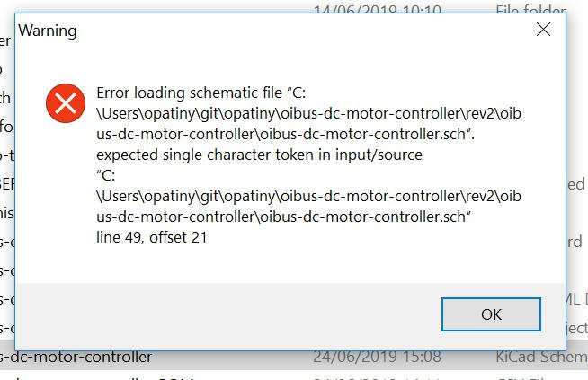

# KiCAD : things good to know

[Home](../../../README.md) | [Rigid-flex PCB](./rigid-flex.md) | [Electronics theory](../theory/theory.md)

## Tutorials and links

General introduction:
[youtube.com/watch?v=zK3rDhJqMu0](youtube.com/watch?v=zK3rDhJqMu0)

Whole KiCAD serie:
[https://www.youtube.com/watch?v=vaCVh2SAZY4&t=313s](https://www.youtube.com/watch?v=vaCVh2SAZY4&t=313s)

## Shortcuts

**? :** for shortcuts help

### Sketch

- **a :** add component
- **e :** see parameters of component
- **g :** grab
- **m :** move
- **p :** add power component
- **r :** rotate
- **q :** add a NC symbol

- **no connect :** blue cross on the right toolbar
- edit the text at the bottom of a sketch: File -> Page Settings
- add **power flags** every time you have a tension difference at a connector
- run debugger once schematic is finished -> you should correct all the errors
- add MPN to a part: click on the Edit symbol fields icon in the schematic

### PCB

**o :** add component
**x :** trace
**v :** via while drawing a trace or change the fronting face
**e :** access properties of component
**f :** move component to the other face
**d :** move tracks according to design rules and nice angles
**b :** refill zones
**u :** select wire till next intersection
**i :** select whole wire

**Ctrl + d :** duplicate / copy

- **copper zone:** click on right layer -> add filled zone (right menu)
- edit **zone priority level**: press "e" while on zone and modify "Zone priority level", the bigger the number, the higher the priority
- **update copper zone :** right-click on zone -> Zones... -> Fill
- **edit design rules :**
- **ratsnest :** all of the airwires
- **DRC :** design rule checker (the ladybird)
- **design rules :** File -> Board setup -> Design rules

## Import new footprints

**DigiKey :**

- go on DigiKey : [https://www.digikey.com/](https://www.digikey.com/)
- search for your part by typing it's reference
- chose the right category (i.e.: Sensors, Transducers)
- you will have many possibilities for your component, click the one where you can buy only one part and without the Digi-Reel packaging
- go under Documents & Media
- go under EDA / CAD Models and click on the part "by SnapEDA"
- click on Download Symbol and Footprint -> KiCAD

You can also directly look for your pard on [SnapEDA](https://www.snapeda.com/home/).

**Component search engine :**
[http://componentsearchengine.com/](http://componentsearchengine.com/)

## Create new footprints

When opening a project, the symbol and footprint editors are in Preferences.

### Schematic

### Layout

## Rules to apply for good PCBs

- always rather **protect to much** than not enough -> for instance power inputs, protect for inverted inputs
- **avoid acute angles**, which make acid traps -> acid remains at these places after board finished and slowly eat the copper traces (not so mush this problem anymore). Yet other problems could occur with high frequencies signals: reflection -> interferences, magnetic fields induced
- use the 3D viewer after making the layout to be sure the labels are well visible
- make **thicker wires for power traces**, all signal traces can be thin (leds, communication)
- place **capacitors** next to the source of the signal you want to filter (inductances as well)
- try to have no errors at all with the bug checker in the schematic
- **attribute your pins** so that the routing is easier on the layout!!

## Create Gerber files

On the board layout, go to File -> Plot

Check Gerbers are good: Project page -> Tools ->Run Gerbview

## Creating BOM (bill of materials)

Two distinct BOMs are created. First, a complete BOM is generated based on the KiCAD layout and is added to the folder so that the person assembling the PCB has an exhaustive list of the components he needs. Secondly, a BOM with only the components specific to the board is created in [octopart.com](octopart.com), which allows to directly order all the parts on DigiKey.

### Export BOM from KiCAD

Click on the export BOM icon on the schematics and chose the bom2grouped_csv plugin, then click generate.

On Mac, use this command (link to adapt):

```
python "/Users/raffael/Desktop/OctanisOÜ/Octanis Instruments/Engineering/KiCAD/BOM_tool/gistfile1.py" "%I" "%O_BOM.csv"
```

Good to know: **MPN** = manufacturer part number

## Various issues

### "error loading schematic file expected single character token in input source kicad"



This error appeared after I added MPN fields in the components description, closed my schematic and tried to open it again. After looking at the text file, it appeared that they were extra CR (carriage return) were the MPN fields were defined. They were removed using a regular expression, which fixed the problem.

### library is charged without error but component doesn't appear (footprint)

- always charge libraries using the **little folder icon**! This really helps
- check and re-check that the library is at the right emplacement

### 4 layers PCB

In the PCB layout click on File -> Board setup... -> Copper layers

### get usable footprint from .mod file

- place your .mod file at the same level as the project you want to use it in
- open Manage Footprint Libraries
- import the .mod file using the folder icon
- go to the Footprint editor
- open the footprint (scroll in the libraries on the left)
- click on File -> Export footprint
- save the footprint in the lib_fp folder

### footprints seem not to snap on grid

Beware what part of the component you have selected. I you selected a pad, it will align on the pad, if you selected the middle of the component, it aligns on it.

### where to place the crystal?

-> [www.ti.com/lit/an/swra495f/swra495f.pdf](www.ti.com/lit/an/swra495f/swra495f.pdf)

- the crystal should be very close to it's capacitors and pins, because it is very low signals (getting noisy very quickly)
- should be placed over a continuous ground plane
- far away from high-speed signals
