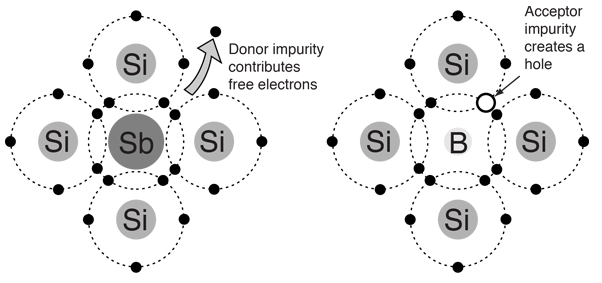
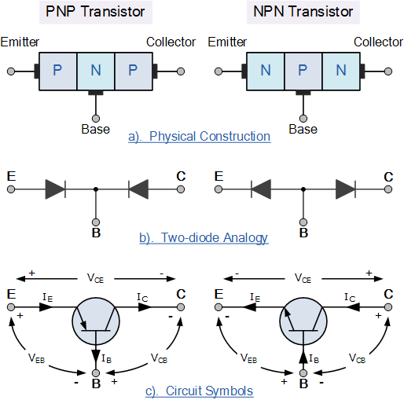
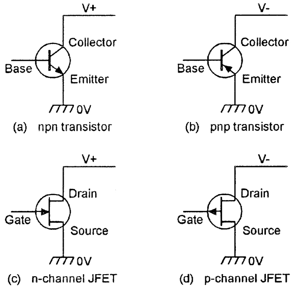

# Theoretical knowledge in electronics and general observations

[Home](../../../README.md) | [KiCAD cheatsheet](../pcb/kicad.md) | [Rigid-flex PCB](../pcb/rigid-flex.md)

## Concepts

### Hall effect

Voltage perpendicular to a current that can be measured when a magnetic field is near it.

### Impedence ($Z$)

"Electrical impedance is the measure of the **opposition that a circuit presents to a current when a voltage is applied\_**. The term complex impedance may be used interchangeably." - Wiki

- "generalized resistance"
- is different from the resistance when there is a frequency in the signal -> AC
- $Z = R + jX$, where $R$ is the **resistance**, $j$ is the complex unit number and $X$ is the **reactance**

### N and P type semiconductor

**N type**
N for negative, because the charge carriers are negative (electrons).

Silicon (Si) crystal with added **phosphorus** (P). Phosphorus is the component next to silicon, which means that it has an additional electron. Therefore, the resulting crystals have extra electrons (not trapped by covalence), which move around freely.

**P type**

P for positive, because the charge carriers ar holes, which are considered as positive charges.

The semiconductor is made of silicon and **boron** (B), which has one electron less that silicon. Since the electrons are moving to always fill the left spaces, holes move around.

### What happens in a diode

[https://www.youtube.com/watch?v=TGUteH93xNo](https://www.youtube.com/watch?v=TGUteH93xNo)

## Electrical circuits and components

### EDS diode

Protective component against electro-static discharges (-> tenths of thousands of volts). Roughly, it can make a huge voltage drop.

### Delta sigma ADC

### Diode clamping circuit

"A clamping circuit (also known as a clamper) will bind the upper or lower extreme of a waveform to a fixed DC voltage level" - Wiki

You have to use zener diodes to clamp. Clamp basically means "take down to" (clamp = serrer).

### Filters

### H-bridge

An H-bridge (half bridge) is an electrical circuit which allows to chose in which direction current is flowing. It can be used to control the spin direction of a motor. It basically consists of four transistors.

### Transistors

- Active component, three-terminal (3 legs)
- can amplify (output signal with more power than input signal)
- can be compared to two diodes (diodes are made in the same material, but are only np or pn)
- a transistor is basically two things : a **current amplifier** or an **electronic switch**
- **npm** and **pnp**: one has the opposite polarities of the other
- **npm** : open when no current, closed when current

- the names npn and pnp refer to the layers inside the component
- transistors have replaced **vacuum tubes** aka **valves** because they heat less and can be a lot smaller
- **SOT :** Small Outline Transistor
- logic gates out of transistors: [https://www.youtube.com/watch?v=SW2Bwc17_wA](https://www.youtube.com/watch?v=SW2Bwc17_wA)
- BJT and FET : [https://www.youtube.com/watch?v=Bine_PbyFSQ](https://www.youtube.com/watch?v=Bine_PbyFSQ)

#### BJT : Bipolar junction transistor

- basically three layers of semi-conductors (like silica) with added components inside the crystal. When voltage is applied on one side, a bridge of charges forms which allows the current to flow through.
- accuracy, low noise
- base, emitter, collector
- when some rules respected, $I_C$ roughly proportional to $I_B$ : $I_C = \beta \cdot I_B$ where $I_B$ is typically 100. $I_C$ and $I_B$ flow to the emitter.
- beware: $\beta$ can vary a lot (temperature and others)
- so a transistor is not an on-off switch! You have all the middle values as well

#### FET : Field-effect transistor

- low power, high impedence, high current switching
- gate, source, drain
- the output current is proportional to the voltage at the gate
- **MOSFET:** Metal Oxide Semiconductor Field-Effect Transistor

### Zener diode

Diode that sinks current when voltage is over a certain threshold -> tries to keep it under the threshold. So, it has a voltage drop that can vary in one direction, whereas it remains the same in the other direction (standard between 0.5 and 0.7V).

-> would allow to make an easy voltage divider

To check : [https://electronics.stackexchange.com/questions/292140/why-is-a-resistor-needed-in-zener-protection-circuit](https://electronics.stackexchange.com/questions/292140/why-is-a-resistor-needed-in-zener-protection-circuit)

## Vocabulary

- **ADC :** analogic digital convertor
- **BTB :** board to board (for connectors)
- **clamp :**
- **current drift :**
- **drain :**
- **hysteresis :** lag in a physical response to an input (response occurs only after the effect)
- **IC :** integrated circuit
- **leakage current :** in general, current that goes through something when it is open (no connection). In the case of a capacitor, current that goes through because the isolator is not perfect
- **low-side and high-side :** whether it is on the high potential or the low potential side
- **MPN** : manufacturer part number
- **NC:** Not Connected
- **open-load :**
- **open drain or open collector output :**
- **SSL :** Solid State Lighting (for connectors)

## Tools tips

### Variable power supply

- beware that the output is on! (little orange light next to "output")

### Oscilloscope

- use trigger on edge (abrupt voltage change)
- trigger has 3 modes: normal (keeps last event), single (keeps first event) and auto (refreshes every new event)

### Multimeter (BM235)

- on resistance analysis mode, click on Select to switch from one mode to the other
- mode 1: beeps when direct electric connection (null resistance)
- mode 2: indicates resistance
