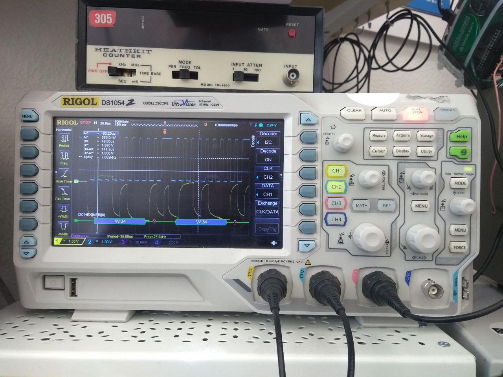

# Tools used in electronics

[Home](../../../README.md) | [KiCAD cheatsheet](../pcb/kicad.md) | [Rigid-flex PCB](../pcb/rigid-flex.md) | [Electronics theory](./theory.md)

## Variable power supply

- beware that the output is on! (little orange light next to "output")

## Oscilloscope

- use trigger on edge (abrupt voltage change) -> the trigger is the menu on the right. The round button allows to move the trigger threshold
- trigger has 3 modes: normal (keeps last event), single (keeps first event) and auto (refreshes every new event)
- decode I2C:
  - click on VERTICAL -> MATH
  - Chose decode 1 or 2
  - Chose Decoder -> I2C
  - Select the right clock channel
  - Select the right data channel
  - The Rigol oscilloscope supports saving a screen­shot as a PNG image file onto a USB “thumb­drive.” The drive must be formatted as FAT32, must be less than 8GB, and must be plugged into the front USB port before turning the unit on. Pressing the print button will capture the screen.

## Multimeter (BM235)

- on resistance analysis mode, click on Select to switch from one mode to the other
- mode 1: beeps when direct electric connection (null resistance)
- mode 2: indicates resistance

## Analog discovery 2 - Diligent

**Definition:** USB oscilloscope, logic analyzer, variable power supply, and multi-function instrument

To install the software (WaveForms), you first have to install this (Adept 2): [https://reference.digilentinc.com/reference/software/adept/start?redirect=1#software_downloads](https://reference.digilentinc.com/reference/software/adept/start?redirect=1#software_downloads)

Then, install WaveForms: [https://resources.digilentinc.com/waveforms-download-64-bit-linux-deb/](https://resources.digilentinc.com/waveforms-download-64-bit-linux-deb/)

### Decode I2C -> logic analyzer

[Documentation on the logic analyser of WaveForms](https://reference.digilentinc.com/learn/instrumentation/tutorials/ad2-logic-analyzer/start)
