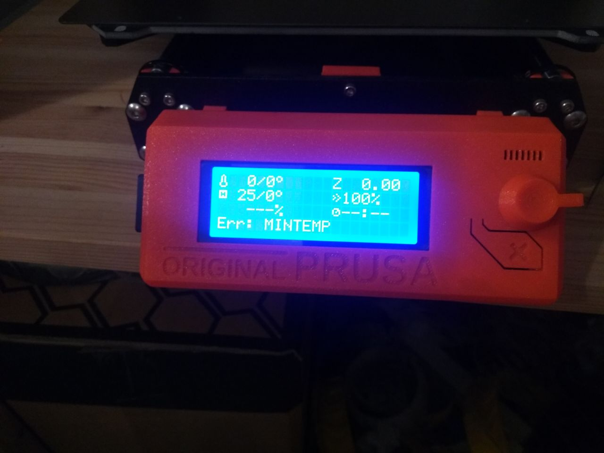

# 3D printers cheat sheet

[Home](../../../README.md) | [Prints parameters](./printsParameters.md)

Click [here](./printsParameters.md) to consult the parameters of all the prints that were realized.

## PrusaSlicer

When you want to print something, you first have to slice it. They are software that allow todo that specifically for certain printers. We use Prusa 3D printers. The corresponding slicer is PrusaSlicer:

[https://www.prusa3d.com/drivers/](https://www.prusa3d.com/drivers/)

Once in the slicer, select the quality of print (std 0.2), the filament type (std Prusament PLA) and the infill (std 25%).

Then click on generate "Slice now" and then on "Export G-code".

To vary the slicer setting and the type of pattern of the top and bottom layers and the infill: [https://manual.slic3r.org/expert-mode/print-settings](https://manual.slic3r.org/expert-mode/print-settings)

## Prusa printers issues

### Firmware update of Prusa printers

**Note:** The plug for the cable is on the top of the black box on the left.

-> refer to [this pdf](./Firmware_upgrade_guide_EN.pdf)

### Head thermistor replacement

**Procedure:** [https://manual.prusa3d.com/Guide/How+to+replace+thermistor+in+the+Extruder/496](https://manual.prusa3d.com/Guide/How+to+replace+thermistor+in+the+Extruder/496)

**2019.07.10:** The replacement of the thermistor first failed because the temperature probe is stuck. I wasn't able to take it out after removing the necessary screws. I suppose it is caused by the plastic that is spread all over the head. I tried melting it using the heat gun for soldering, but it didn't work.

## Fixing under-extrusion problems and general maintenance

Remove a blob: [https://www.youtube.com/watch?v=mSmJKjibMT0](https://www.youtube.com/watch?v=mSmJKjibMT0)

Clean a clogged nozzle: [https://www.youtube.com/watch?v=g8uvh6kvr54](https://www.youtube.com/watch?v=g8uvh6kvr54)

### Procedure

- preheat to right filament temperature and unload filament
- if there is a **blob** of plastic, use a pair of **pliers** to unstick it (while hot)
- remove rests of plastic on the nozzle either with **metal wool** or a **brass brush**
- use an **acupuncture needle** to free the nozzle

- **unscrew** the sides of the head to be able to put filament in or out by hand
- the head can be pull of **plastic dust**, if it is, use **cotton swabs** or a tissue to remove it (I put isopropanol to clean more easily, don't know if it's a good idea. Could it partially dissolve 3D printed plastic parts?)
- load a resistant and "elastic" plastic like **nylon**, I tried with PET
- cool the nozzle down to around 100 degrees (I tried 120, 110 and 100 degrees, but never really worked well)
- firmly pull on the filament to take it out (this is called a **cold pull**), you can repeat this a few times
- close the head
- load filament

- clean dirt from rectified axes
- **grease** them again
- clean printing surface with **isopropanol**

- print a part to check if all the things you did were at all useful...

## Errors

### MINTEMP

If you get that error and have the nozzle temperature that is 0/0°, there probably is a connection problem at the level of the temperature probe of the nozzle.

## Renkforce 3D printers

### Ultimaker Cura

The appropriate slicer for the Renkforce 3D printers is Ultimaker Cura:
[https://ultimaker.com/en/blog/52831-simplify-3d-printing-with-ultimaker-cura-40](https://ultimaker.com/en/blog/52831-simplify-3d-printing-with-ultimaker-cura-40)

## Cetus3D printer

### Up Studio

The slicer for the Cetus3D printer is called Up Studio:
[https://www.tiertime.com/up-studio/](https://www.tiertime.com/up-studio/)

Install the software directly on a computer connected to the printer. You can slice and print without going through an SD card.

### Support is really hard to remove

Try lowering the temperature of the head by 5 deg Celcius. This still does not work really well...

### Part sticks to bed to well

- be sure that the bed is cold
- use a spatula to gently lift it

### Part doesn't stick to bed

Try calibrating the printer.

### Calibrate a Cetus3D printer

- click on the calibrate icon (right-angle ruler)
- to check if the calibration is good, place a piece of paper on the bed and move the head to the same height as the "Nozzle Height": if the nozzle doesn't press against the paper, the printer is not calibrated well
- in that case, click on the "Manual" button
- place a piece of paper (can be folded in two) on the bed and click on the top-left position (they are 9 points to do)
  - use the arrows to move the head up or down
  - the nozzle should press on the paper so that there is resistance when you draw on it
  - click on the circular symbol next to the arrows to move to the next point
  - repeat for all 9 points
  - Confirm
- you should see that the "Nozzle Height" has changed

### Under-extrusion

If the printer starts under-extruding after being calibrated, it might be that the nozzle has been set to be too close to the bed, which causes it to get clogged. If that happens, proceed as follow:
- withdraw filament (if is gets stuck at the gears level, get access to the gears and cut the part of filament causing troubles)
- open the gears part
- clean any residuals of plastic on the gears
- heat up the head by pressing "Withdraw" again
- use acupuncture needle to clean nozzle
- close gears part
- re-insert filament
- check that extrusion is good
- manually calibrate the printer again (take care not to be too close to the bed again...)

### nozzle touches the bed and scratches glue layer

- it seems that the printer is not calibrated well, so you have to re-calibrate it but first:
- if the glue layer is really damaged, you might want to remove it
- unscrew the three screws in the middle of the bed
- take the bed off
- pour some acetone on the bed and use a scraper to remove all the glue
- once the bed is clean use spray glue to make a new layer of glue (it can be really thin and hardly visible)
- screw the bed back in place, make sure that it is fixed well enough not to be able to rotate
- calibrate the printer again

### printer makes weird ticking noises while calibrating

When calibrating, the printer goes to the end of each axis, where it bumps into something. This generates a spike in the stepper motors power consumption, which allows to set the origin of the axis. Along the Y axis, the head bumps into a screw, which tends to loosen itself. Therefore, the bump is not detected and the head moves up and down repeatedly. To fix this, tighten the screw a bit.
