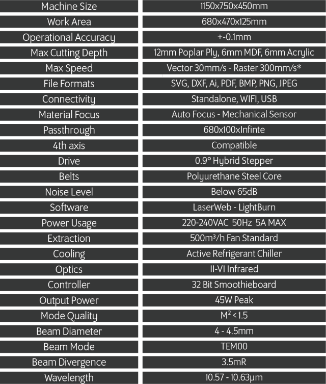
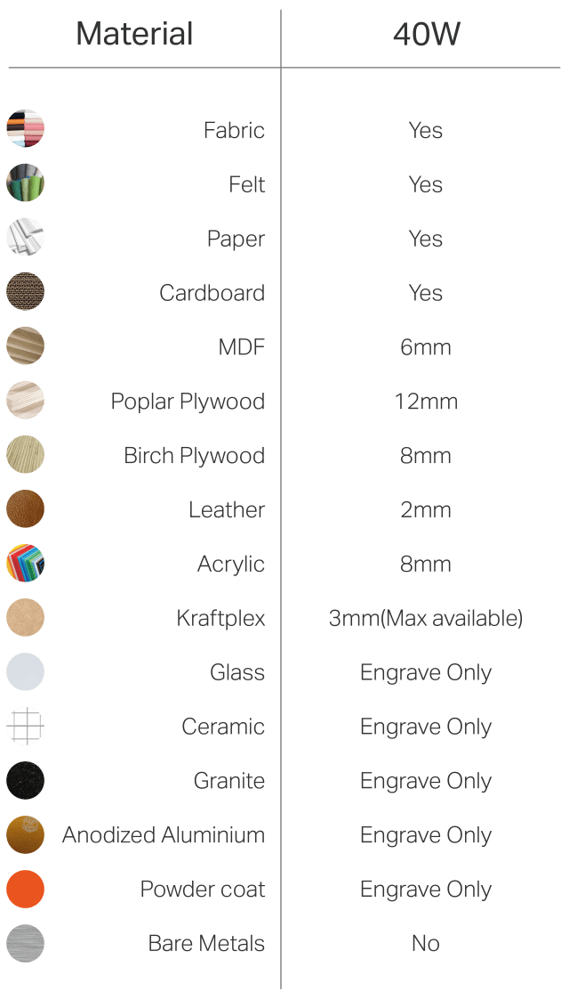

# Using the laser cutter (FabKit MI5)

[Home](../../../README.md)

## General information

- **Laser cutter used:** [FabKit MI5](https://www.fabcreator.com/Fabkit)
- **Max cut dimensions:** 680x470yx125mm
- **Software:** [LightBurn](https://lightburnsoftware.com/)
- **File formats accepted:** DXF and SVG, however, DXF works a lot better

## FabKit MI5

## LightBurn

### Procedure

- turn on chiller and wait for the temperature to be below 17°C
- turn on laser cutter computer (switch is underneath the computer) and open [LightBurn](https://lightburnsoftware.com/pages/trial-version-try-before-you-buy)
- open your file (not import!), be sure that you show all files and not only .lbr and check that the dimensions are right
- chose the layers and cutting settings (chose predefined settings in the Library tab)
- enter you ID in the Terminal to turn the laser cutter on
- in the Move tab, press the Home icon
- place your material in the cutter
- use the arrows in te Move tab to position the laser in the middle of you material
- in the Move tab, press Focus Z
- set you Origin (preferably user define origin)
- check cut dimensions (go Frame)
- turn filter and compressor on
- insert key and turn on the laser
- cut your part
- remove key
- turn filter and compressor off
- turn off chiller
- turn off computer
- turn off laser cutter

### Errors

#### X or Y hard limit error

- clear the error
- press home

#### -Z hard limit error

Once you get this error (because the laser hit the bed or something), the software doesn't allow you to move the bed up or down anymore. So, you have move it down. To do that, slip your fingers under the front panel of the laser cutter to access the belt. Pilling it towards the right should make the bed go down. Clear the error.

## Links

- global info aboutFabKit MI5: [https://www.fabcreator.com/Fabkit](https://www.fabcreator.com/Fabkit)
- laser cutter forum : [http://community.fabcreator.com/search?q=software](http://community.fabcreator.com/search?q=software)
- laser cutter software (LightBurn) : [https://lightburnsoftware.com/pages/trial-version-try-before-you-buy](https://lightburnsoftware.com/pages/trial-version-try-before-you-buy)
