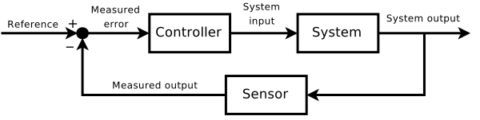

# Bases of control theory

## Definition

Control theory is a subfield of mathematics. The objective is to keep a constantly varying system as close as possible to a goal state/value. (inspired from Wikipedia)

## Vocabulary

- **Control output (CO):** corrected state of the actuator output. It is also called **regulator**
- **Plant:** the system that you want to control (combination of process and **actuator** )
- **Process variable:** the thing that is measured/sensed/observed
- **Set point:** the goal value of the process variable
- **Open-loop (feedback) control:** control action of the controller **independent** from the process variable
- **Closed-loop (feedback) control:** control action of the controller **dependent** from the process variable -> **feedback**

## Control algorithms

They are different algorithms that can be implemented in a controller, depending on the type of behaviour that is needed. In the case of Octanis, three types are used:

1. **PID (Proportional Integral Derivative):** the CO is calculated using a formula with three coefficients as parameters
2. **On/Off:** the CO depends is set depending if the PV is over or outside of a given range (max and min thresholds)
3. **Timer:** the output is high for a given amount of time, then it is turned off -> time is the PV