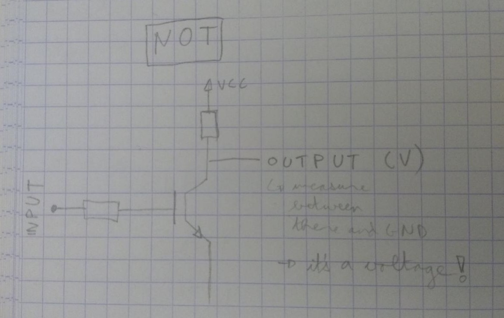
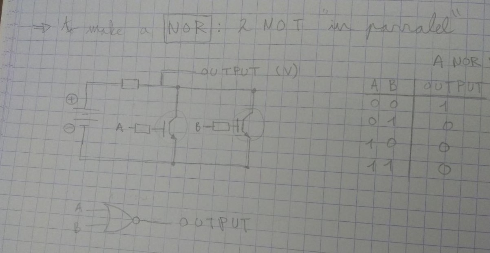
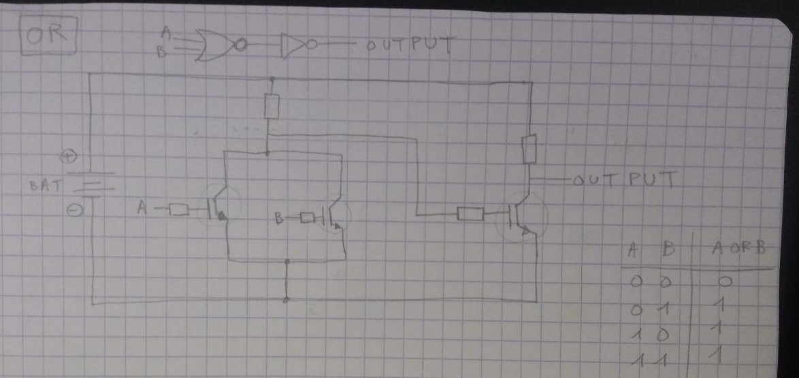
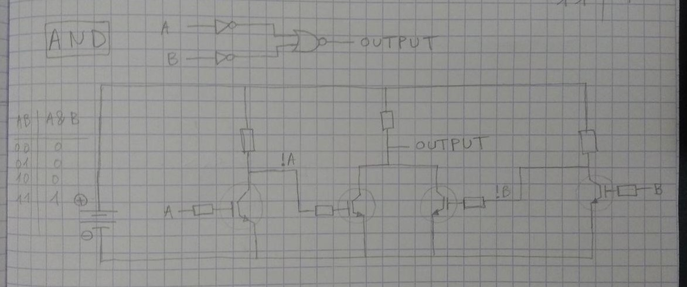

# Small side project: transistors logic gates building blocs

[Home](../../README.md)

__Goal :__ Make PCBs that act as logic gates based on transistors (NOT, OR, AND). Understand how transistors work and how to build logic gates using them. Draw the schematics that correspond to the 3 logic gates AND, OR and NOT. Transpose to KiCAD, make layout and send for production. Find a smart way to interconnect the boards. Make the boards as small as possible.

## Basic schematics

### NOT

### NOR

### OR

### AND

## FPGA

Somewhat in the same idea, think about FPGA (Field Programmable Gate Array). It basically consists of AND, NOT and OR gates that can be connected together however the user wants. TO do that, the "programming languages" VHDL or Verilog are used. The advantage of this technology is that it works at very high frequencies and if very fast. To implement more complex functionalities then e.g. additions, the code corresponding to them can be found online/bought (like cosine, decrypt I2C or USB).

FPGA (Field -> VHDL or verilog (programming languages)
