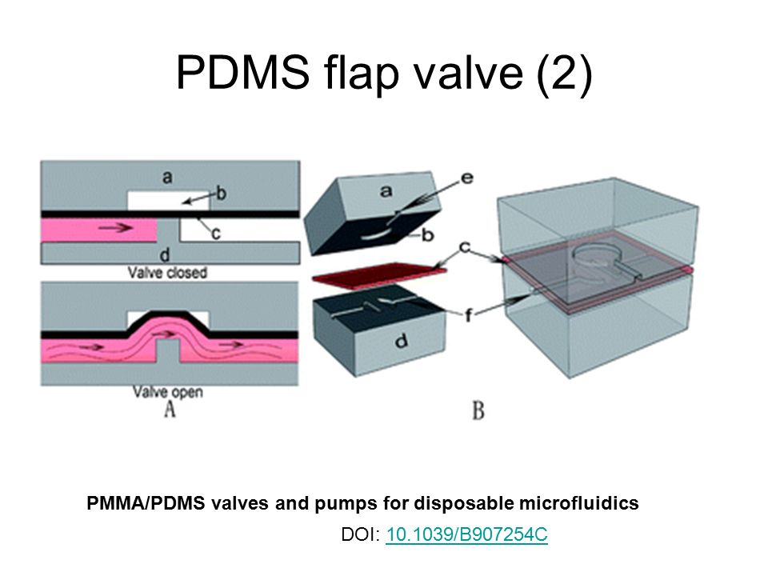

# Micro fluidics application

[Home](../../README.md)

**Goal :** Find an application in micro-fluidics for the valve control developed by Octanis Instruments. We should consider that it is possible to get a precise pressure at some point in a pneumatic circuit. Design the load.

**Idea :** Device allowing to get 5 precise concentrations of a solution from a concentrated solution and a solvent. The final solutions should allow to realise calibration curves.

## Theory

[https://www.elveflow.com/microfluidic-tutorials/microfluidic-reviews-and-tutorials/flow-control-in-microfluidic-device/](https://www.elveflow.com/microfluidic-tutorials/microfluidic-reviews-and-tutorials/flow-control-in-microfluidic-device/)

How could we make a valve?

## Interesting points

- Using PDMS resin allows to integrate things inside of the microfluidics chip (sensors, stirrers, heating, microcontrollers,...).
- ABS can be 3D printed to get nearly any shape and then be dissolved using acetone

## Constrains

- channels thickness: 1 mm wide and 0.5 mm high

## Links

General micro-fluidics : [https://metafluidics.org/?s=mixer](https://metafluidics.org/?s=mixer)

Symbols explanation : [https://www.youtube.com/watch?v=ajLRtRs92lY](https://www.youtube.com/watch?v=ajLRtRs92lY)

Usage examples :

[https://www.youtube.com/watch?v=LkAq667Zg9c](https://www.youtube.com/watch?v=LkAq667Zg9c)

Mixers:

[https://www.youtube.com/watch?v=8mW7TJPPcDs](https://www.youtube.com/watch?v=8mW7TJPPcDs)

[https://www.youtube.com/watch?v=AMQkW9yXjR8](https://www.youtube.com/watch?v=AMQkW9yXjR8)

**PDMS resin** and ABS filament (and acetone)!!!
[https://www.youtube.com/watch?v=7z8I7awRYY4](https://www.youtube.com/watch?v=7z8I7awRYY4)

Shrink dink (temperature shrinking plastic sheet):
[https://www.youtube.com/watch?v=eNBg_1GPuH0](https://www.youtube.com/watch?v=eNBg_1GPuH0)

Valve - micro-fluidics chip interface : [https://uk.rs-online.com/web/p/pneumatic-straight-fittings/1216176/](https://uk.rs-online.com/web/p/pneumatic-straight-fittings/1216176/)

- microfluidics valve
  - [http://2016.igem.org/Team:Uppsala/Project/Microfluidics](http://2016.igem.org/Team:Uppsala/Project/Microfluidics)
- how to easily bond PDMS and Plexiglass
  - microwave? -> [https://www.youtube.com/watch?v=fMUemBZ0k5Q](https://www.youtube.com/watch?v=fMUemBZ0k5Q)
  - [http://2018.igem.org/Team:Madrid-OLM/HardawareMicrofluidics#workflowPDMS](http://2018.igem.org/Team:Madrid-OLM/HardawareMicrofluidics#workflowPDMS)
