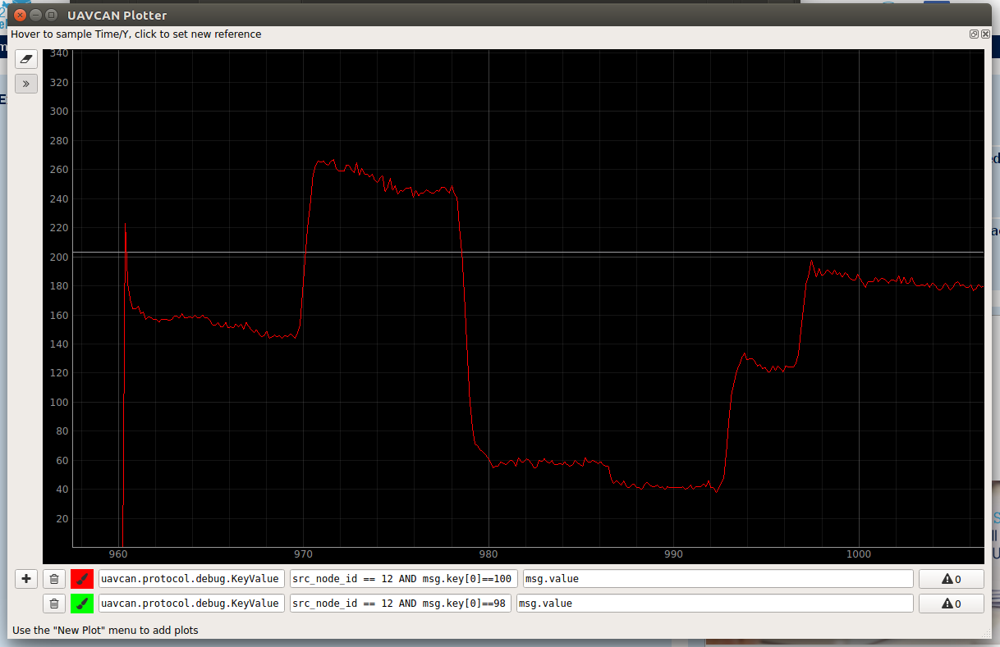
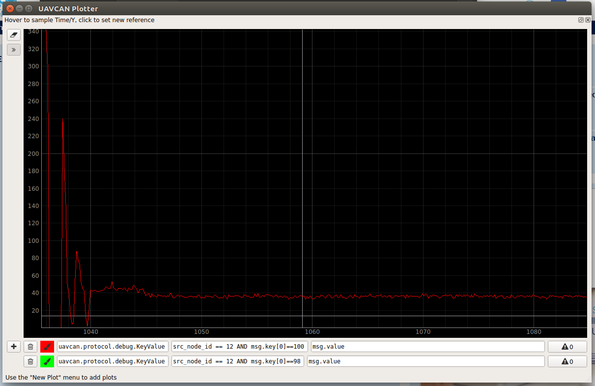
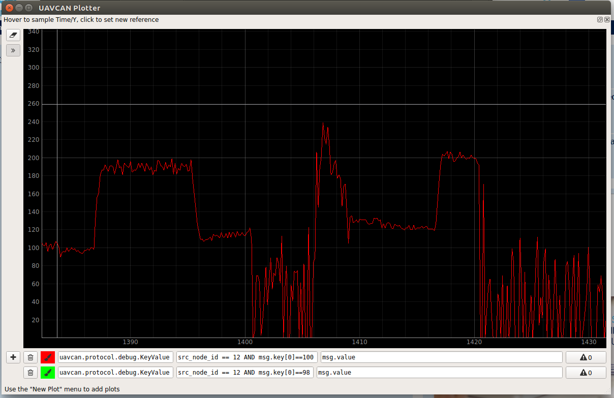
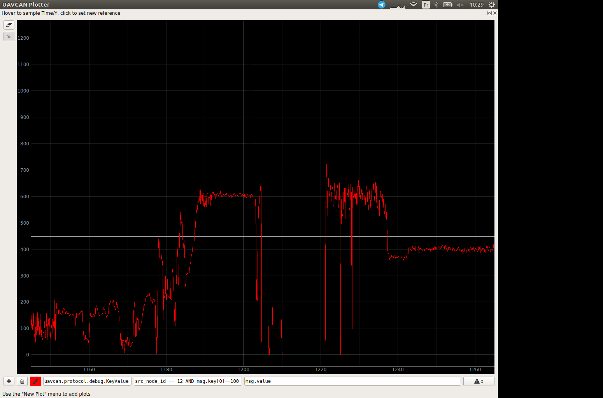
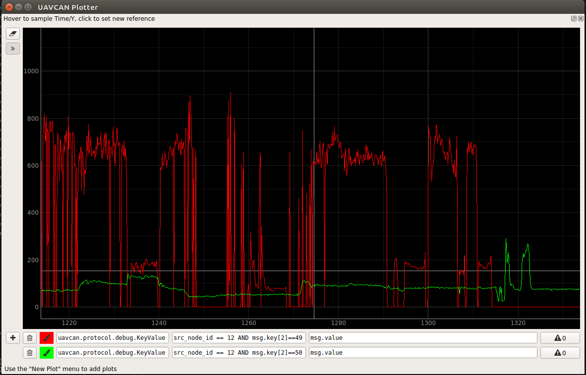
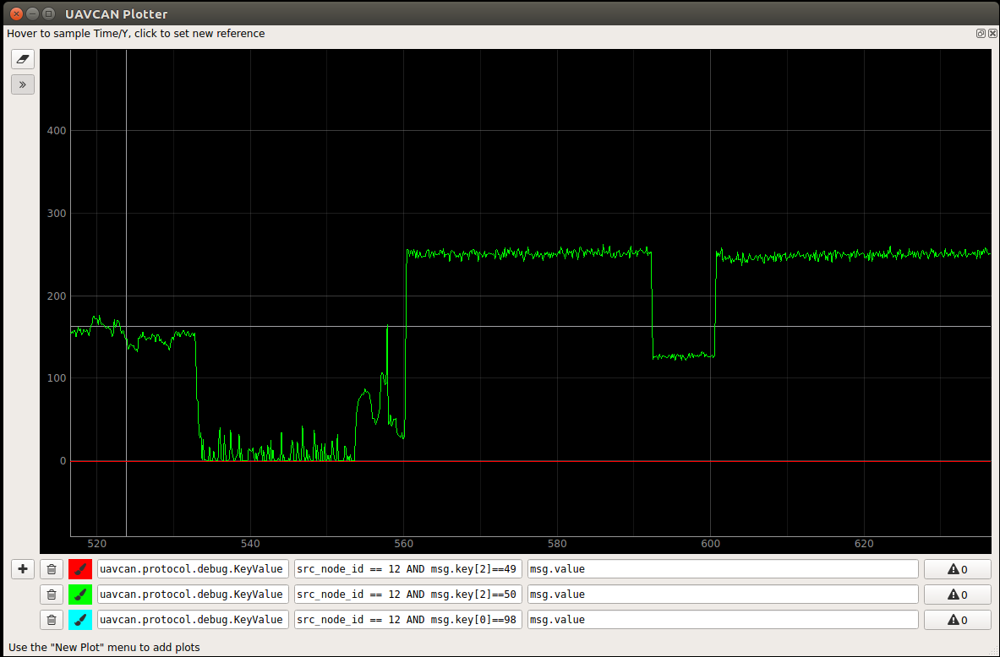
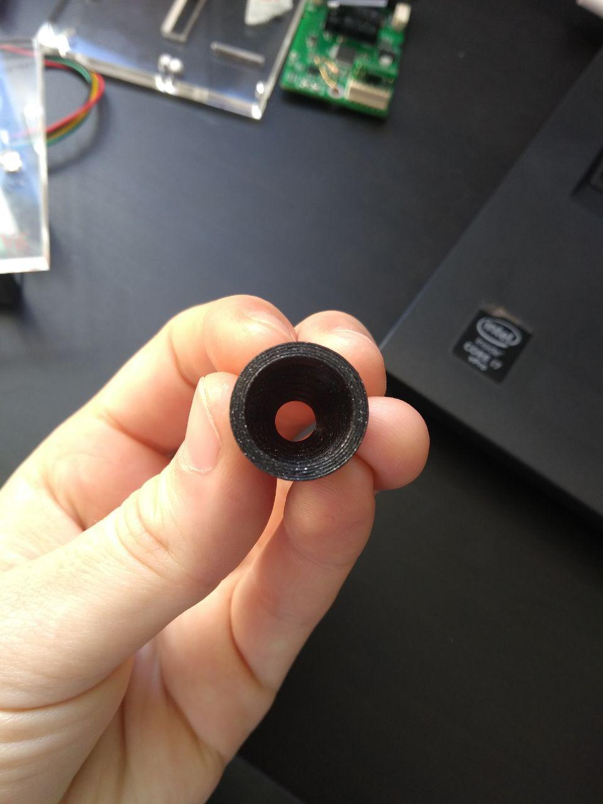
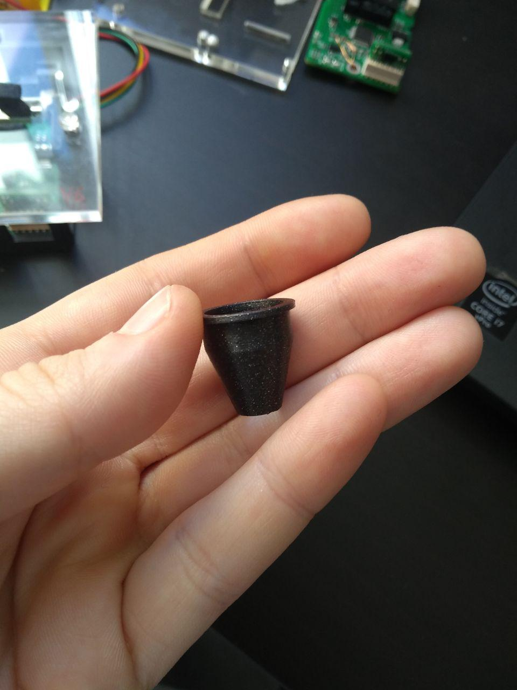
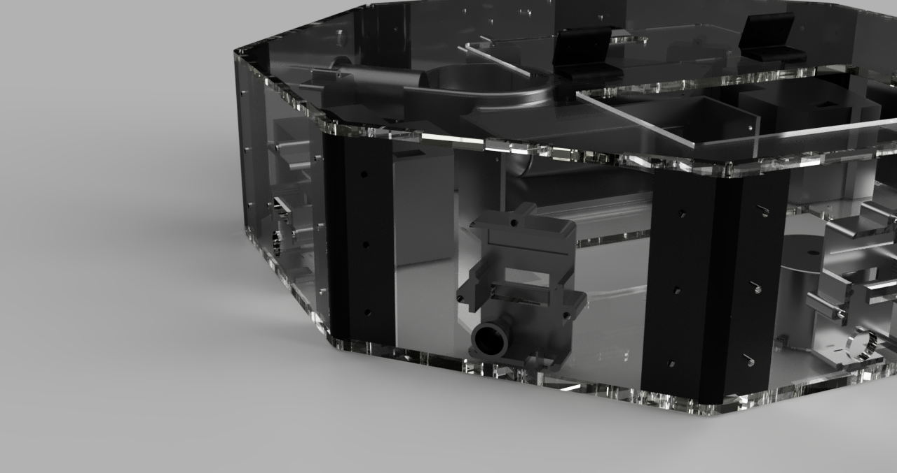

# Fixing the distance module crosstalk problem

[Home](../../../README.md) | [Project main page](../../vacrob.md) | [Distance module main page](../distanceModules.md) | [Links / References](../../docs/references/refs.md)

## Context

The distance sensor that we are using, the VL53L0X, is not made to be used with a cover glass by default. Initially, we thought there would be no problem in case plexiglass was used as the cover glass, since it has a very high transmittance in the emitted frequency (infra-red). However, it is not the case, and we experience an important crosstalk problem whenever a cover glass is used.

They are two possible solutions to this problem:
- The API of the sensor allows to re-calibrate it for a specific application with cover glass. However this appears difficult. (should still be tried someday)
- A hardware hack can be made to physically prevent the emitted light to bounce of the glass and come back on the receiver.

This second possibility seemed more likely to work in the time that we had. The idea initially comes from a YouTube video:

## Hardware hack

The concept behind this hack is fairly simple. The goal is to build a physical obstacle between the emitter and the receiver, which prevents the light to bounce of the cover glass and directly hi the receiver. In the video, the obstacle and the cover glass are very close to the sensor (>5mm). In our case, however, this is not possible. The cover glass (5mm clear plexiglass) is about 20 mm away from the sensor. This distance is limited by all the thick components on the distance module (including the daughter board, which is the thickest one).

## Tests and results

### No cover glass (horizontal)

For more tests, refer to [Sensor test][../sensorTest/sensorTest.md].

### Cover glass and hack (horizontal)

A distance module is fixed in a small PCB case 2 v4. A piece of 5 mm plexiglass is laid on top of the case.

### Cover glass and hack (horizontal)

A distance module is fixed in a small PCB case 2 v4. The case is screwed to a crosstalk test v5 cut in 5mm plexiglass. The 3D printed crosstalk part (v5, slightly adjusted) is inserted in the slot.

When the 3D printed part is slightly moved around, the results can be better and we can measure a distance up to 600 mm. This is however very unreliable.

## Conclusions

The hack as it is in version 5 is very unreliable and only allows to get a range half as god as without cover glass. This does not seem to be a good approach. Now, what we can do is either to try to re-calibrate the sensor with software, or use no cover glass just above the sensors.

It is difficult to estimate which option is better. For a vacuum cleaner, it would be necessary to have the sensors covered and the PCBs protected from ambient dust. However this might be too difficult to do in the next two weeks.

## More tests with distance module revision 2

This time, the hack seems to be working a lot better, allowing measurements up to 800 mm. Over this value, there is a clear status error -> the distance is -1, quite reliably.

### Cover glass and hack (vertical)

The hack has also been tested with the vertical distance sensor, which requires less precision: we only want to know it there is any risk for the robot to fall. We see that the base signal when obstacle is too far  (out of range) is very noisy. However when there is a target, the noise is smaller.

## Final hack

In the end, the hardware hack described above has only been used for the vertical distance sensor. Indeed, these sensors are only used to avoid fall, so the precision required is low. Additionally, that sensor will be very exposed to dust, since it is so close to the ground. Therefore, we do not want it to be exposed (by having a direct opening over it).

In the case of the horizontal sensor, however, the exposure to dust in considerably smaller. What is more, precision is very important. Therefore, we decided to use a cone, with a small opening on the sensor. In this way, we have the full range and precision that the sensor offers. See the images underneath for more information.

_Horizontal crosstalk hack part 3D print: top view_

_Horizontal crosstalk hack part 3D print: side view_

_Fusion rendering of the crosstalk hack_