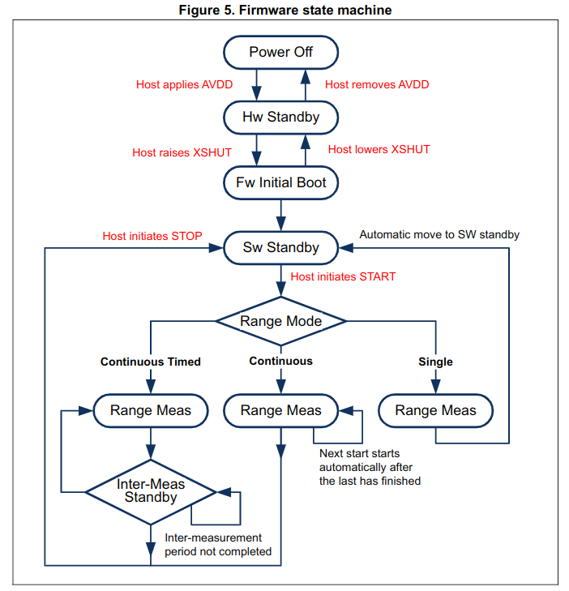
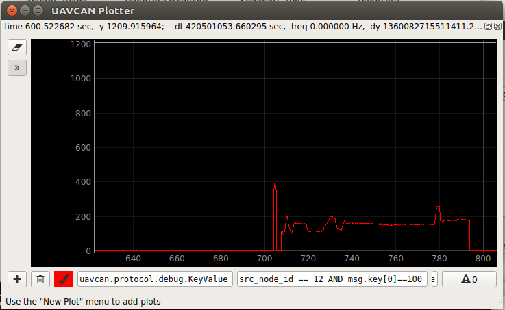

# Distance modules firmware writing - Lab Notebook

[Home](../../../README.md) | [Project main page](../../vacrob.md) | [Fixing crosstalk problem](../crosstalk/crosstalk.md) | [Testing distance sensor](../sensorTest/sensorTest.md) | [Links / References](../../docs/references/refs.md)


**The distance module has got its own repository:** [https://make.octanis.ch/oi/oibus-mini-distance-module](https://make.octanis.ch/oi/oibus-mini-distance-module)

## Bumper

An interrupt has been coded to get the bumper state. The interrupt is defined in the `freertos.c` file in the function `HAL_GPIO_EXT1_Callback()`.
Debouncing has been implemented using the `HAL_GetTick()` function to get the time.

## Distance sensors

The distance sensors on the distance module have only one I2C address: **0x52** ([datasheet](../datasheets/vl53l0x_distance_sensor.pdf)) p.18). The two distance sensors are therefore connected to two distinct I2C buses. Mother board sensor is on I2C1 and daughter board sensor is on I2C2.

The message type to use for the distance sensor output: [https://github.com/UAVCAN/public_regulated_data_types/blob/master/uavcan/equipment/range_sensor/1050.Measurement.uavcan](https://github.com/UAVCAN/public_regulated_data_types/blob/master/uavcan/equipment/range_sensor/1050.Measurement.uavcan)



The sensor measurements are based on Single Photon Avalanche Diodes (**SPADs**).

## Distance sensor (VL53L) API UM notes

### Initializing the distance sensors (initial calibration)

Functions to run at the beginning to get the device working (from the [API UM](./vl53l0x-api-description.pdf)). **To do once for each use setting!**

```C
// device initialization
VL53L0X_DataInit();
// loading settings
VL53L0X_StaticInit();
// SPADs calibration, to do in case of cover glass -> returns number and type of spads to be used (2 values to store!)
VL53L0X_PerformRefSpadManagement();
//adjustment of the device sensitivity when temperature varies (to make every time temperature varies from more than 8 degrees C)
VL53L0X_PerformRefCalibration();
// can be necessary in case of cover glass
// run the function with device at 100mm from white reflective surface, in the dark
// returns the offset value in micrometers
VL53L0X_PerformOffsetCalibration();;

// in case of cover glass, cross-talk calibration might also be needed -> quite complicated
// VL53L0X_PerformXTalkCalibration()
```

### Initialization and calibration

**To execute once after every reset!**

```C
// device initialization (to cal once and only once after reboot)
VL53L0X_DataInit();
// loading settings
VL53L0X_StaticInit();
// get type and number of SPADs stored on host
VL53L0X_GetReferenceSpads();
// set the type and number of spads to the right values
VL53L0X_SetReferenceSpads();
// load calibration parameters
VL53L0X_SetRefCalibration();
// load offset from host memory
VL53L0X_SetOffsetCalibrationDataMicroMeter();

// enable cross-talk calibration and load data
VL53L0X_SetXTalkCompensationEnable();
VL53L0X_SetXTalkCompensationRateMegaCps();

// select one of the three ranging modes (continuous, single, continuous timed)
VL53L0X_SetDeviceMode();

// configures the system interrupt mode
VL53L0X_SetGPIOConfig();
```

### Ranging

Setting up the type of measurements and how to retrieve the data.

```C
// for timed continuous ranging
VL53L0X_SetInterMeasurementPeriodMilliSeconds();
// set ranging time -> the longer, the more accurate the measurement, standard is 33 miliseconds
VL53L0X_SetMeasurementTimingBudgetMicroSeconds();
// start measurement with chosen mode
VL53L0X_StartMeasurement();
// get a status on the ongoing measurement
VL53L0X_GetMeasurementDataReady();

// get measurement, first value is range in mm
VL53L0X_GetRangingMeasurementData();
// get error status -> should be 0 if data is valid
VL53L0X_GetRangeStatusString();
```

Apparently, the firmware can be used to change the device I2C address!

```C
VL53L0X_SetDeviceAddress();
```

## Trying to communicate through I2C with the distance sensor (Epic fail)

Test code is written inside of the `freertos.c` file, it the default task.

Problem: The existing API for the VL53L has to be adapted to the STM32 at the level of the I2C communication (-> write adapted driver).

We use HAL functions to communicate in I2C with the sensor. The first test that needs to be run is to check if the sensor is responding on the I2C bus. To do that, we used the `HAL_I2C_IsDeviceReady(I2C_HandleTypeDef *hi2c, uint16_t DevAddress, uint32_t Trials, uint32_t Timeout);` function.

```c
HAL_I2C_IsDeviceReady(&hi2c1, (uint16_t)(address<<1), 2, 2);
```

The best way to see if the sensor is actually responding is to use the oscilloscope and to connect it on the I2C bus (-> the middle header on the board). Then, the I2C bus cn be decoded. In our case, we got `W:34 W:34`. This is the hexadecimal value for 52 52. The first 52 is sent by the MCU. THe second one it the acknowlegment sent by the distance sensor. This shows that everything is fine with the sensor from a hardware point of view -> it is soldered well.


Setup for the I2C bus decoding.


Result of the decoder

**CAUTION:** What I did there was **completely wrong**... Firstly, the device address that I used is false. The right address is `0x52`... Secondly, there was the message 52 twice on the bus, because **the MCU made two trials to connect to the sensor** -> read functions prototypes/doc!!!

So let's start this all over again.

After running some more tests and asking Raph for advice, he thought that the hardware could be wrong. After checking the PCB, we realized that the SDA and SCA lines were inverted....

## Trying to communicate through I2C with the distance sensor again after fixing hardware with wires

Let's start with what we know from the VL53L datasheet:

- the device has one I2C address: `0x52`
- every time the MCU wants to communicate with the I2C device, it will:
  - send the device address slided one bit to the left. The first bit of the byte (lsb: least significant byte) has value 0 if the mcu wants to write and 1 if it wants to read
    - lsb: 1 -> read, 0 -> write
  - wait for an acknowledge bit from the sensor, which is the SDA line that goes high and is driven low while SCL is low (refer to image)
  - continue with the desired register address on one byte
  - ...
- a message can only be ended by the bus master
-


It still didn't work. The reason for that is the XSHUT pin, which was low. Toggling this pin allowed the sensor to boot, and it worked afterwards.


VL53L drives SDA line low after it's address is sent on the I2C bus -> acknowledge bit.

The correct funtion:

```c
HAL_I2C_IsDeviceReady(&hi2c1, 0x52, 1, 10);
```

## Retrieving the value of a register

A second step in communicating with the sensor, as well as learning how the HAL I2C functions work is to try retrieving the value of one of the registers. We want to try to get the serial number.

First, we have to check the VL53L datasheet to know in which register it might be.


In the datasheet, there is no register for the serial number. So we will try to retrieve the value of register 0xC1, which should have value 0xAA (=170).


VL53L answers with the value expected (170).

Function used to get this:

```c
  uint16_t address = 0x52;
  uint16_t registerPointer = 0xC1;
  uint8_t returnValue = 0;
  uint16_t size = 1;

    HAL_I2C_Mem_Read(&hi2c1, address, registerPointer, I2C_MEMADD_SIZE_8BIT, &returnValue, size, 1000);
```

## Struggling with the continuous ranging example from the distance sensor API

Trying to get the example with continuous ranging to work -> managed to retrieve some data from the sensor with `GetDeviceInfo()`. However, unable to get the `staticInit` to work -> problem with the reference SPADs (`Status = -50`).

**To do:** try to see if the device type is actually requested from the module, and check where this type is used.

[Forum dealing with this exact issue](https://community.st.com/s/question/0D50X00009XkYOCSA3/spad-initialization-error)

**Solution:** The problem was actually in the **bad implementation of the api I2C communication** -> copying the code given on the forum (slightly adapted) worked fine. The device datasheet described the protocol necessary to read and write bytes, this is where I might have seen that my implementation was faulty.

Once this was done, I was able to read the distance and see it in the debugger. 

**Caution:** Range measurement is only valid if `pRangingMeasurementData->RangeStatus = 0`.

## Code structure

The distance will be retrieved using a code based on the continuous ranging example. One additional feature has to be added to the ones existing: we must be able to chose on which I2C bus the device is. To implement this, an additional property is added to the `VL53L0X_Dev_t` structures, which is a pointer on an instance of type `I2C_HandleTypeDef *` (i2C bus definition). This property is then used in the platform specific I2C communication code.

Once the bus choice worked, the continuous ranging example has been simplified and subdivided into two functions: the first one handles all the initialization and calibration, the second one is an infinite loop executing continuous measurements.

## Creating separate threads for both distance sensors

New threads can be initialized in CubeMX -> save and commit the code before you make any modifications using CubeMX.

## Plotting the distance in `uavcan_gui_tools`

`uavcan_gui_tool` has a tool to plot a parameter that is being sent on the uavcan bus. Here is how you do it:

**Hardware:**
- connect a distance board with a functionnal firmware to a CAN to USB board
- connect the CAN to USB board to your computer
- 
**Software:**
- in a terminal, run `uavcan_gui_tool`
- a window pops up, modify the "CAN bus bit rate" to 100000 (remove one zero) and click ok
- if everything is fine, the main graphical interface should open
  
  

- click on the set local node ID tick -> the previously detected nodes get a name and you can now double-click on them to access their parameters
  
  

- click on Tools -> Bus monitor: to see all the packages on the CAN bus -> click on one of the packages to see more info (for instance the key)
  
  

- click on Tools -> Plotter -> New Plot -> Add Y-T plot: a new plot appears
  
  

- now you have to set the parameters that you want to monitor: click on the little "+"
- there, you define the parameter to be plotted by specifying the message key, you have to do that letter by letter, using ASKII code (see image)
  
  

- see the evolution of your variables
  
  


Here, we are plotting both distances and the bumper status.


