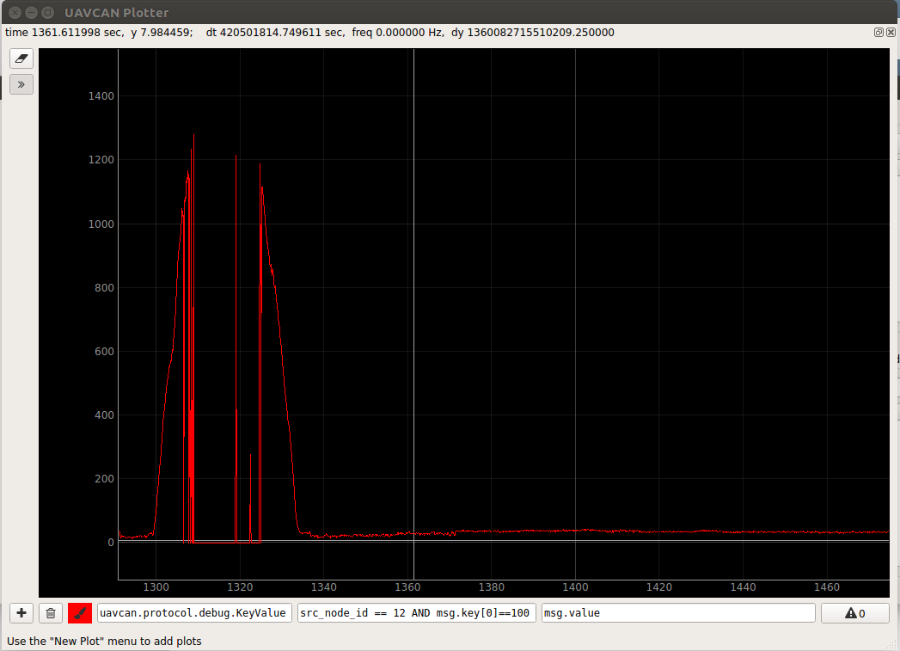
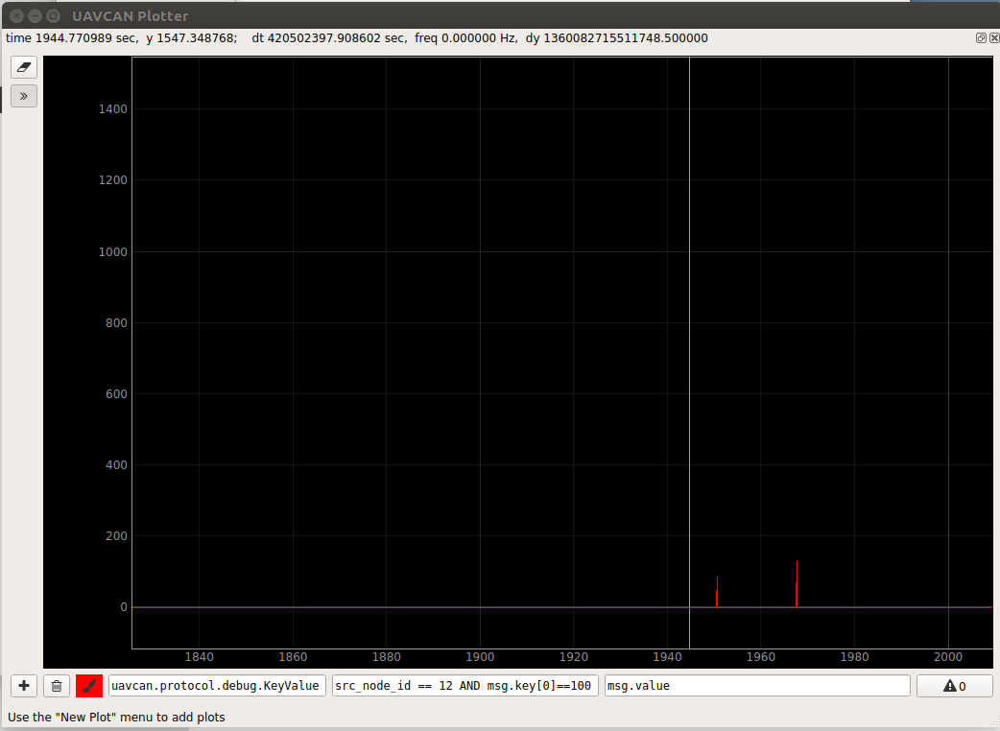
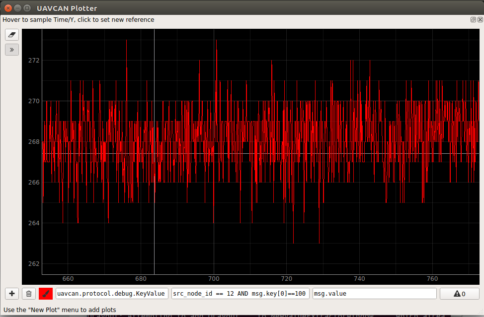
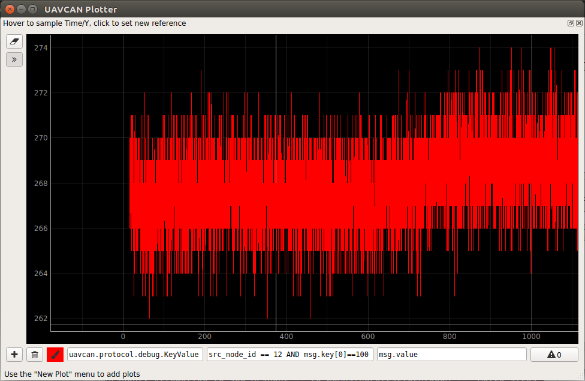
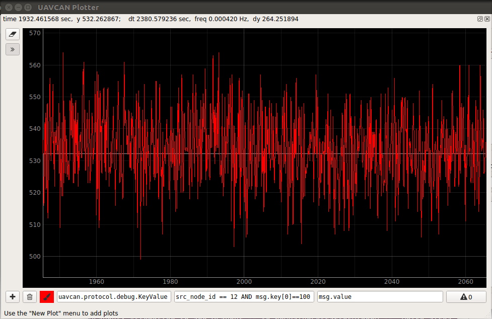

## Testing the range and precision of the distance sensor

[Home](../../../README.md) | [Project main page](../../vacrob.md) | [Distance module firmware (lab notebook)](../firmware/distance-module-fw-LN.md) | [Fixing crosstalk problem](../crosstalk/crosstalk.md) | [Links / References](../../docs/references/refs.md)

For these tests, no cover glass was used. For the cover glass tests, refer to: [Fixing crosstalk problem](./crosstalk.md).

We use `uavcan_gui_tool` to display the distance measurements. The units of the graphs are: vertical -> distance in mm, horizontal -> time in s.

### Test 1: range span

**Procedure:** The distance module was first laid on the floor (dark grey), then slowly raised up (trying to remain parallel to the floor) up to about 1.5m.

**Observations:**
- the maximal range before the range status gives some error is approx. 1150 mm on a dark grey target

### Test 2: noise when range has error status

The distance sensor log a parameters that indicate whether the last measurement is valid. We process this information and set the distance to -1 in case of an error. Here, we want to test the noise in a situation where the distance is clearly over the max range (-> error).

**Procedure:** The distance module is left on the bench, face up. It doesn't detect anything because the ceiling is too far away.

**Observations:**
- "false positives" are extremely scarce

### Test 3: noise on fixed distance

#### 25 cm, white target

**Procedure:** The distance module is placed perpendicularly to the bench at 25.0 cm from a white target (see image for exact setup). 

Graph of about 2 min of measurements:

Graph of about 20 min of measurements:

**Observations:**
- the approximate average distance measured is 268 mm -> 16 mm too much compared to actual distance
- the noise is of approx. 4 mm in this setup

#### 75 cm, dark grey target

**Procedure:** The distance module is placed on the bench, face down so that is senses the floor (dark grey). The actual distance is 75.0 cm (measured with measuring stick).

Graph of about 2 min of measurements:

**Observations:**
- the approximate average distance measured is 268 mm -> 16 mm too much compared to actual distance
- the noise is of approx. 4 mm in this setup