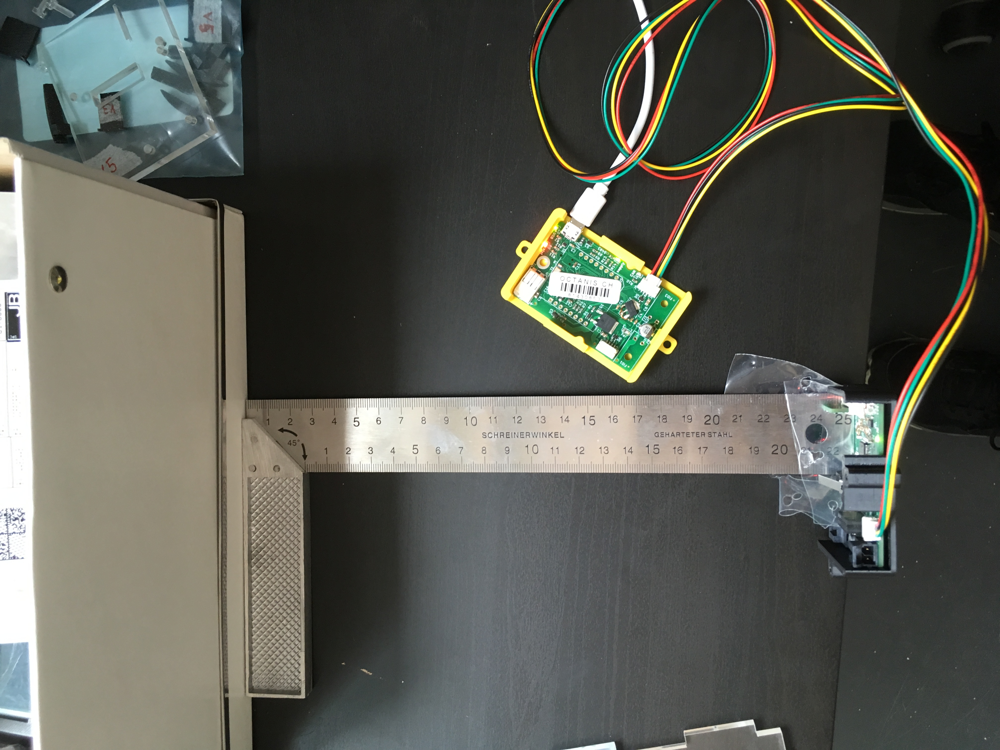
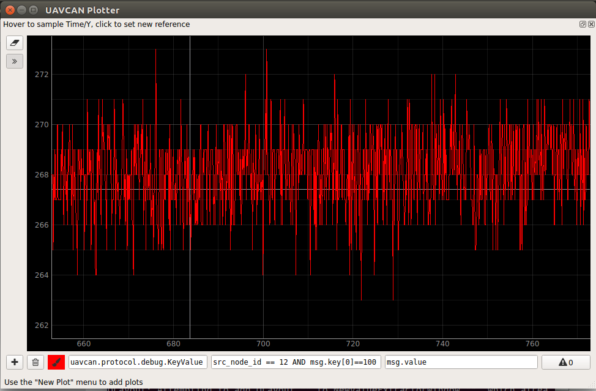
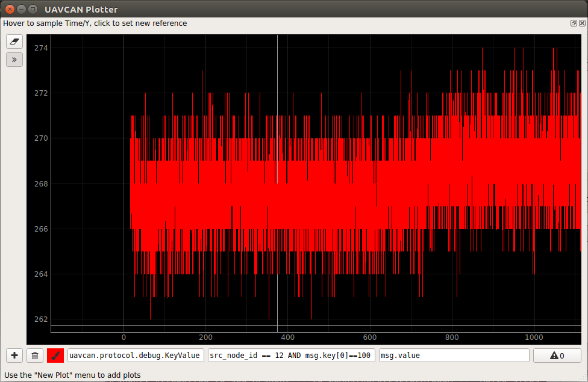
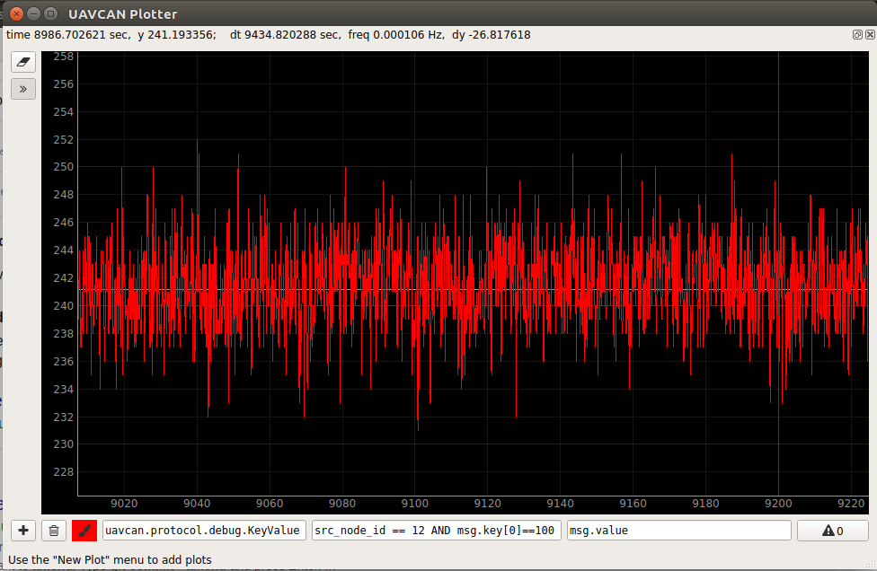
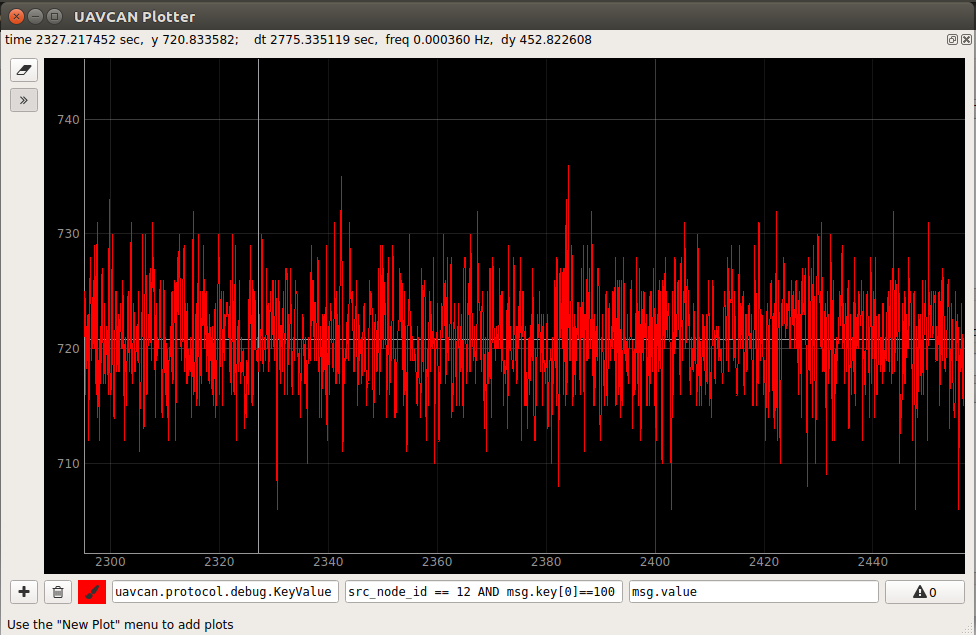
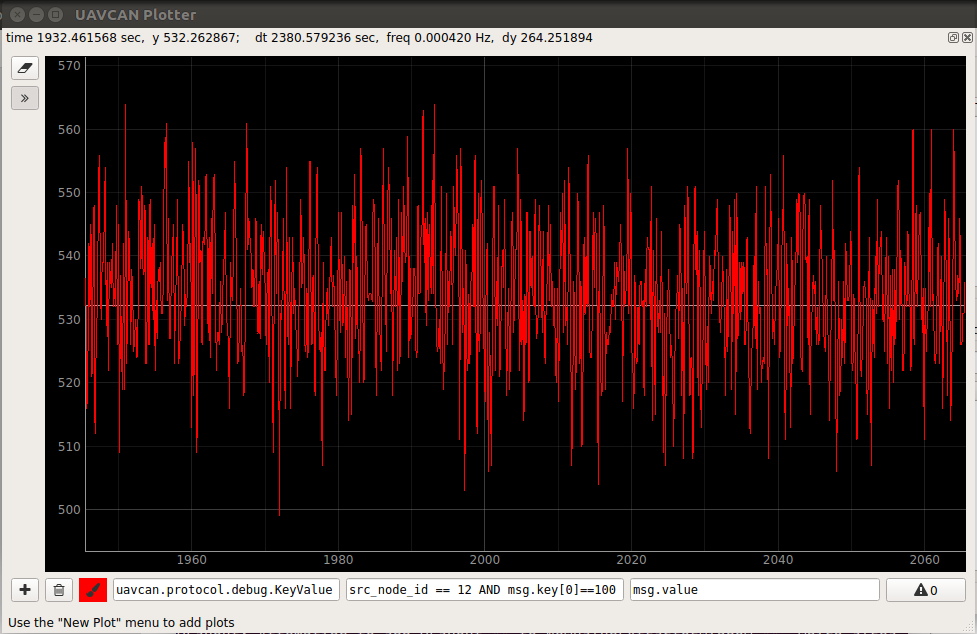
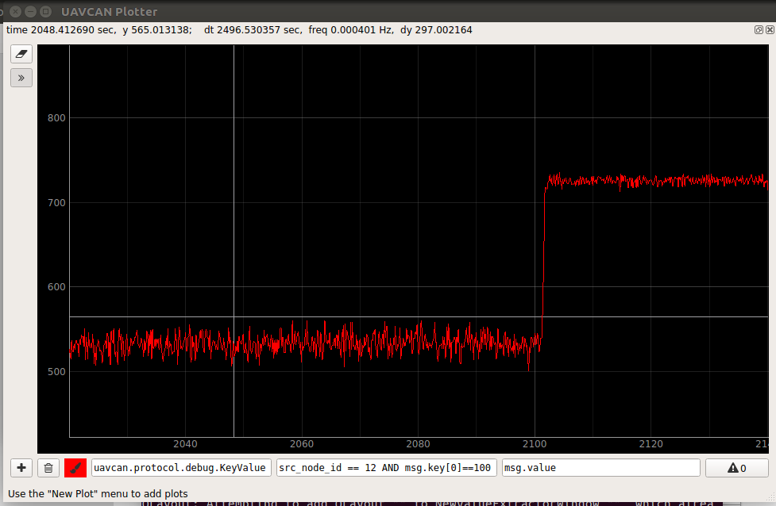

# Testing the range and precision of the distance sensor (VL53l0X)

[Home](../../../README.md) | [Project main page](../../vacrob.md) | [Distance module firmware (lab notebook)](../firmware/distance-module-fw-LN.md) | [Fixing crosstalk problem](../crosstalk/crosstalk.md) | [Links / References](../../docs/references/refs.md)

For these tests, no cover glass was used. For the cover glass tests, refer to: [Fixing crosstalk problem](../crosstalk/crosstalk.md).

We use `uavcan_gui_tool` to display the distance measurements. The units of the graphs are: vertical -> distance in mm, horizontal -> time in s.

## Test 1: range span

**Procedure:** The distance module was first laid on the floor (dark grey), then slowly raised up (trying to remain parallel to the floor) up to about 1.5m.

**Observations:**
- The maximal range before the range status gives some error is approx. 1100 mm on a dark grey target

## Test 2: noise when range has error status

The distance sensor log a parameters that indicate whether the last measurement is valid. We process this information and set the distance to -1 in case of an error. Here, we want to test the noise in a situation where the distance is clearly over the max range (-> error).

**Procedure:** The distance module is left on the bench, face up. It doesn't detect anything because the ceiling is too far away.

**Observations:**
- "false positives" are extremely scarce

## Test 3: noise and offset on fixed distance

The distance module is placed at a fixed distance from a target of a specific color.

In this experiment, we call **offset** the difference between the measured distance and the actual distance.

The **average measured distance** is estimated with the bare eye from the plots.

The **uncertainty** is the plus minus value that has to be added to the average measured distance to include all the measurements.

### Experiment 1: 25 cm, white target

**Procedure:** The distance module is placed perpendicularly to the bench at 25.0 cm from a white target -> cardboard storing box(see image for exact setup). 

Graph of about 2 min of measurements:

Graph of about 20 min of measurements:

**Observations:**
- Average measured distance: 268 mm 
- Offset: 16 mm
- Uncertainty: 4 mm

### Experiment 2: 25 cm, black target

**Procedure:** The distance module is placed perpendicularly to the bench at 25.0 cm from a black target -> piece of thick black paper. 

Graph of about 2 min of measurements:

**Observations:**
- Average measured distance: 241 mm 
- Offset: -9 mm
- Uncertainty: 9 mm

### Experiment 3: 75 cm, white target

**Procedure:** The distance module is placed on the bench, face down so that is senses the floor, a sheet of white paper is placed on the floor. The actual distance from sensor to target is 75.0 cm (measured with measuring stick).

Graph of about 2 min of measurements:

**Observations:**
- Average measured distance: 721 mm 
- Offset: -39 mm
- Uncertainty: 15 mm

### Experiment 4: 75 cm, dark grey target

**Procedure:** The distance module is placed on the bench, face down so that is senses the floor (dark grey). The actual distance from sensor to target is 75.0 cm (measured with measuring stick).

Graph of about 2 min of measurements:

**Observations:**
- Average measured distance: 535 mm 
- Offset: -215 mm
- Uncertainty: 30 mm

### Summary of all measurements

|                                | Exp. 1 | Exp. 2 | Exp. 3 |    Exp. 4 |
| ------------------------------ | -----: | -----: | -----: | --------: |
| Target Color                   |  White |  Black |  White | Dark grey |
| Actual distance [mm]           |    250 |    250 |    750 |       750 |
| Average measured distance [mm] |    268 |    241 |    721 |       535 |
| Offset [mm]                    |     16 |     -9 |    -39 |      -215 |
| Uncertainty [mm]               |      4 |      9 |     15 |        30 |

### Global remarks

More data would be required to confirm the following statements.

- In our results, the uncertainty on the measurement is twice bigger if the target is dark.
- When the distance measured is big, a dark target can have an offset up to 5 times bigger.
- A white target can be too reflective for small distances which results in a positive offset.

## Test 4: switch from light to dark target

**Procedure:** The distance module is placed face down on the table so that the horizontal sensor has the ground as target (distance is 75cm). A white sheet of paper is placed on the floor, and then removed. 

**Observations:** 
- The measured distance is smaller when the target is dark as when it is white.
- The noise is bigger when the target is dark.
- The offset is bigger when the target is dark.
