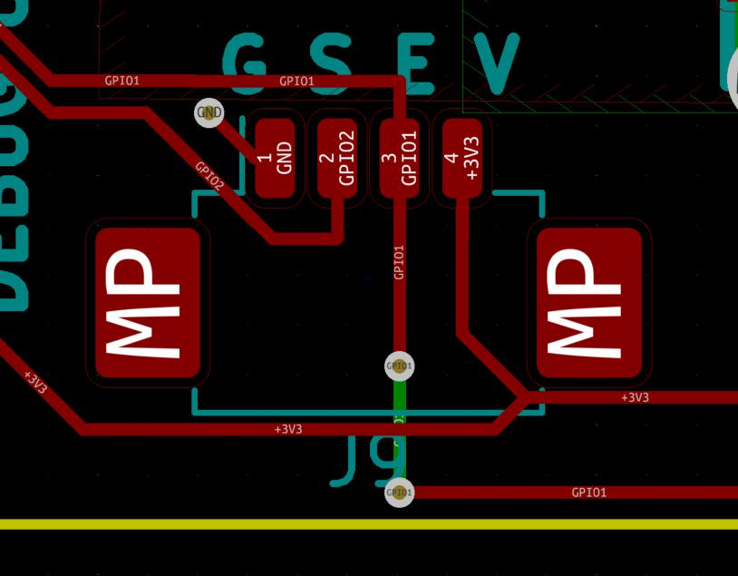
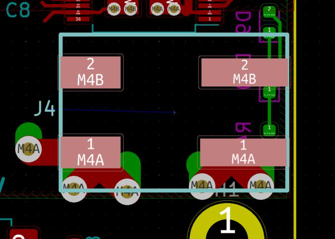
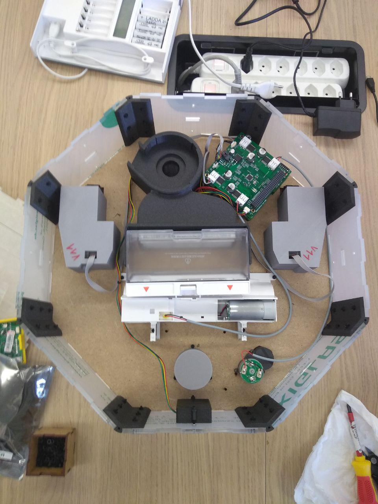
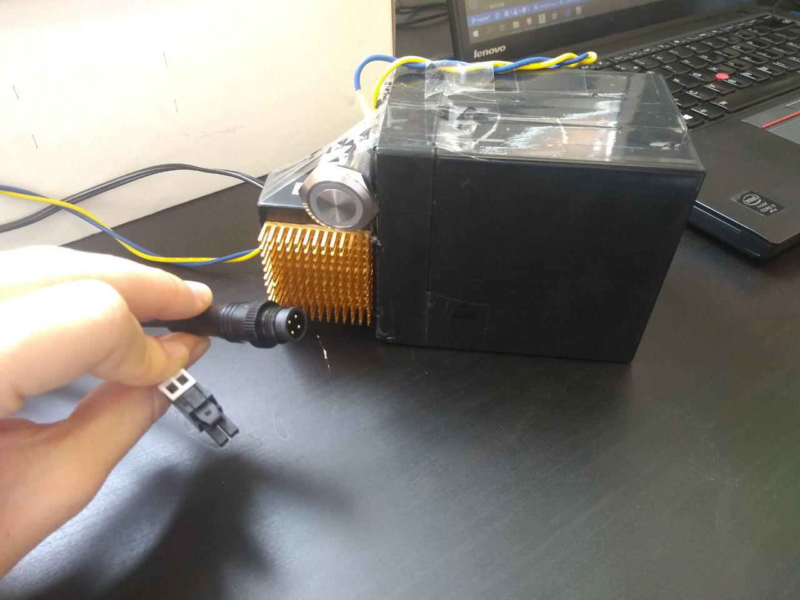

# Describing the assembly of the electronics of the VacRob

Things that were useful to know:

- a motor is like an inductor, so plus and minus are electronically connected
- polarity of the motors when connecting to the board do not matter, because current will anyways flow in both direction to rotate in one direction or the other

## Connecting the big wheels to the DC motor module

On the wheel side, there is a card edge connector with the following specifications:

- Pitch: 1.25mm
- Number of pins: 6
- PCB thickness: 1.2mm

Looking online did not give results for matching female connectors. Therefore, we will solder cables directly on the connector, at least at first.

On the DC motor board side, they are two connectors:

Molex_PicoBlade_53261-0471_1x04-1MP_P1.25mm_Horizontal (for the encoder)

WAGO-2061 (for the power)

We use AWG28 cables to connect the wheels to the DC motor board. This cable can tolerate a maximal current of 1.4 A. We tested the wheels motor power consumption using a power supply. It goes up to

## Connecting brushes to DC motor board

We do not need the encoder information from the brushes motors because we don't need them to rotate very precisely. Therefore, two cables where simply soldered on the plus and minus poles of the motors and were connected to the board.

All motors connected, except pump.

## Battery

In the end, one big battery still fitted in the robot, so this was used instead of packs of 18x650 batteries. The battery used is an RS Pro Lead-acid battery 12V/5AH/20HR. A recharge module has been added to it, as well as an on/off switch (see image). Two output connectors were soldered onto it: a Molex Unifit to power the boards (left), and a M12 IP68 connector 4 pins for recharge (right).

## Distance boards

The distance sensing boards are part of the UAVCAN bus and they are easily connected using the CAN cables (daisy-chained).

## Lidar

## Screen
