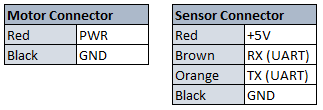

# Lidar on the VacRob

One of the main sensors that are placed on the robot is a lidar. This works by emitting a laser pulse and calculating the time it takes to get back (light sensor). The whole device spins, which allows to get distance measurements on a whole plane with a high resolution (1 pt/degree). The lidar that we use is the **Neato XV11 Lidar** (that is found on the neato vacuum robots).

## Some specifications

**Neato XV11 lidar:**

- 360 points per rotation
- controlled through UART (RX/TX)
- around 100 USD

## Position and fixation on the VacRob

The lidar is placed on the robot's top, about 15 cm away from it's center. It is fixed with spacers and 4 M3 screws. The laser is at a height of about 20 cm above the ground. This could be a problem to detect very low objects, but the distance modules should compensate this a little.

## Wiring



Neato lidar pinout

They are 6 cables to connect.


Computer module:
- **Motor:** GND and 3.3V
  - GND: H102, pin 28
  - 3.3V: J104, pa
- **Comms:** RX and TX (solder 0 Ohm resistors on JP111 and JP112)
  - RX: H10, pin 39
  - TX: H101, pin 40
- **Lidar power:** GND and 5V
  - GND: H102, pin 25
  - 5V: H102, pin 29

## Reading data

Procedure to follow: [https://wiki.ros.org/xv_11_laser_driver/Tutorials/Running%20the%20XV-11%20Node](https://wiki.ros.org/xv_11_laser_driver/Tutorials/Running%20the%20XV-11%20Node)

- we connect the robot computer to an external screen, keyboard and mouse
- we get internet through an Ethernet cable
- we power the raspberry through micro usb -> this also powers the lidar and the lidar motor
- we use the `screen` command to see if there is any data on the serial bus. `screen` takes two arguments: port and baud rate!  
  ```bash
  screen /dev/ttyAMA0 115200
  ```

## Links

- tutorial on how to test/use the lidar: [https://www.impulseadventure.com/elec/robot-lidar-neato-xv11.html](https://www.impulseadventure.com/elec/robot-lidar-neato-xv11.html)
- manage to visualize the data in ROS: [https://wiki.ros.org/xv_11_laser_driver/Tutorials/Running%20the%20XV-11%20Node](https://wiki.ros.org/xv_11_laser_driver/Tutorials/Running%20the%20XV-11%20Node)