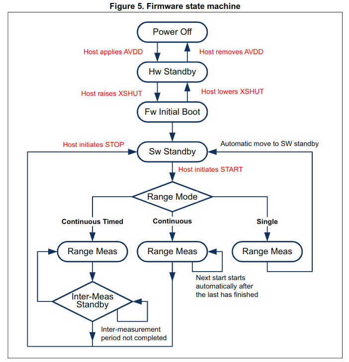

# Software / Frimware

## UAVCAN


## Distance modules

### Bumper

An interrupt has been coded to get the bumper state. The interrupt is defined in the `freertos.c` file in the function `HAL_GPIO_EXT1_Callback()`.

### Distance sensors

The distance sensors on the distance module have only one I2C address: **0x52** ([datasheet](../datasheets/vl53l0x_distance_sensor.pdf)) p.18). The two distance sensors are therefore connected to two distinct I2C buses.

The message type to use for the distance sensor output: [https://github.com/UAVCAN/public_regulated_data_types/blob/master/uavcan/equipment/range_sensor/1050.Measurement.uavcan](https://github.com/UAVCAN/public_regulated_data_types/blob/master/uavcan/equipment/range_sensor/1050.Measurement.uavcan)



The sensor measurements are based on Single Photon Avalanche Diodes (**SPADs**).

#### Initializing the distance sensors

Functions to run at the beginning to get the device working (from the [API UM](./vl53l0x-api-description.pdf)). **To execute after every reset!**

```C
// device initialization
VL53L0X_DataInit(); 
// loading settings
VL53L0X_StaticInit();
// SPADs callibration, to do in case of cover glass -> returns number and type of spads to be used (2 values to store!)
VL53L0X_PerformRefSpadManagement();
//adjustment of the device sensitivity when temperature varies (to make every time temperature varies from more than 8 degrees C)
VL53L0X_PerformRefCalibration(); 
// can be necessary in case of cover glass
// run the function with device at 100mm from white reflective surface, in the dark
// returns the offset value in micrometers
VL53L0X_PerformOffsetCalibration();

// in case of cover glass, cross-talk calibration might also be needed -> quite complicated

```
