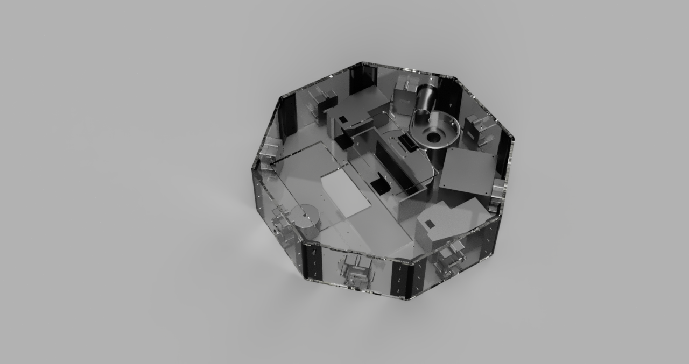
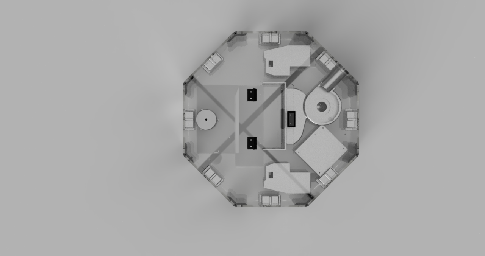
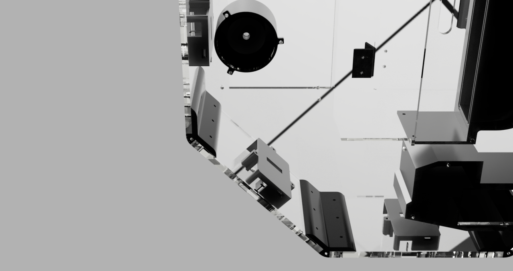
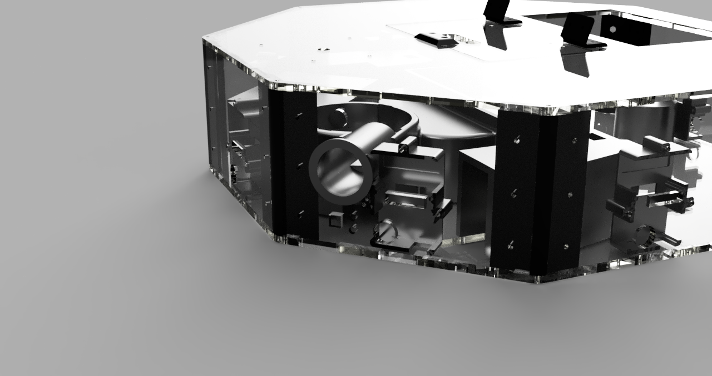
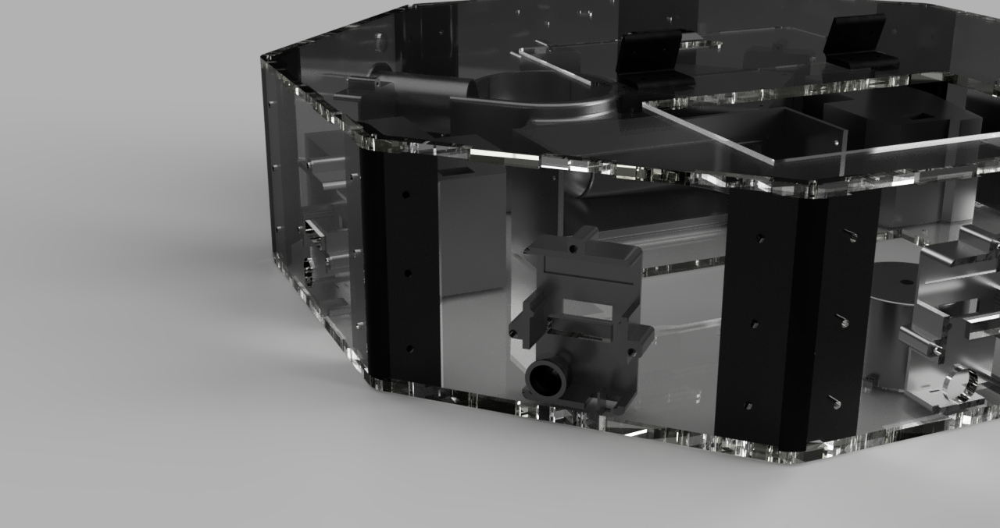

# Fourth assembly of the VacRob case (2019.11.20)

[Home](../../README.md) | [Project main page](../vacrob.md) | [Links / References](../docs/refs.md) | [Mechanics doc](./mechanics.md)

This is the last version of the VacRob which has been assembled during the internship.

## Renderings from Fusion 360 of the assembly (v30)

_Side / Top_

_Top_

_Bottom / Side closeup_

_Pump face_

_Crosstalk hack_

## Files versions

- top v18
- bottom crosstalk v4
- face v9
- pump face v11
- corner v20
- front wheel fix 2 v8
- hinge v4
- clip v2
- bottom clip v2
- dust collector pump v16
- pump output v4
- wheel fix v11
- main brush spacers (to cut out of plexi or mdf)

## Materials

- 5 mm acrylic glass (PMMA) -> three 500x500x5 sheets are perfect
  - 1 bottom
  - 1 top
  - 1 flap
  - 7 faces
  - 1 pump face
  
- Prusament PLA
  - 1 bottom clip
  - 8 corners
  - 1 front wheel fix
  - 2 wheel fix
  - 1 pump dust collector part
  
- FlexiSmart flexible filament
  - 2 hinges
  - 1 pump output
  
- M3x10 screws (clear acrylic)
  - fix bottom to corners (8)
  - fix small PCB cases (24)

- 81 M3x15 screws (black nylon and clear acrylic)
  - front wheel (3)
  - hinges (8)
  - fix corners to faces (48)
  - top and bottom clip (2)
  - lidar (8)
  - main wheels (8)
  - main brush (4)
  - dust collector - pump part (5)
  
- 65 M3 black nylon bolts
  - fix corners to faces (48)
  - top and bottom clip (2)
  - front wheel (3)
  - hinges (8)
  - main brush (4)
  
- 16 M3x8 double-female black nylon spacers
  - lidar (8)
  - big PCB (8)

### Modifications following third assembly

- bottom, top and faces made in plexiglass
  - problem: the tolerance on the bottom crosstalk slits is not the same on every slit. Some glue might need to be used to hold them in place
- faces and bottom were modified to include the crosstalk hacks
- crosstalk parts were modeled and 3D printed
  - the part for the horizontal sensor is a cone which leaves the distance sensor directly exposed to the outside -> it allows to have the full sensor range and precision
  - the part for the vertical sensor is a kind of wall separating the emitter and the receiver of the sensor, therefore avoiding crosstalk. We didn't do a cone in this case because the sensor is very close to the ground and exposed to dust. Also, the required precision isn't as high.
- all the parts are cut out of plexiglass to see the interior of the robot
- small PCB case 2 are used, which were also necessary because of the crosstalk problem: the fixations have been placed on the sides so that the vertical distance sensor is as close as possible to the ground. Also, we included threads directly in the cases, so that no spacers or bolts are needed anymore, just one screw. This was sometimes a little bit problematic because the screws were difficult to tighten.
- the front wheel fix part has been replaced (from v6 to v8)

### Things that are good

- small PCB case 3 really allows to have the distance boards close to the ground
- the new system to fix the small PCB cases, using printed M3 threads is better then before (less parts), but the screws are sometimes difficult to tighten
- now that the robot is fully assembled, we see that its weight is sufficient to squeeze the wheels springs
- the plexiglass case, once the protective plastic is removed, looks pretty cool
- the front wheel can move freely now

### Things to enhance

- uavcan cables are a lot too long

Some of the previous issues that haven't been fixed yet (already existing in assembly 3):
- still adapt the position of the flap a bit
- model a part that will act as a spacer for the main brush that would also guide the dust (avoid it to go everywhere in the robot)
- find a solution to the side brush position: as it is, it doesn't allow to clean the corners well

### General comments

- one of the connectors to the motors (on the motor board) was broken. We used a screwdriver to press on the connector to slide in the cable and the plastic part broke.
