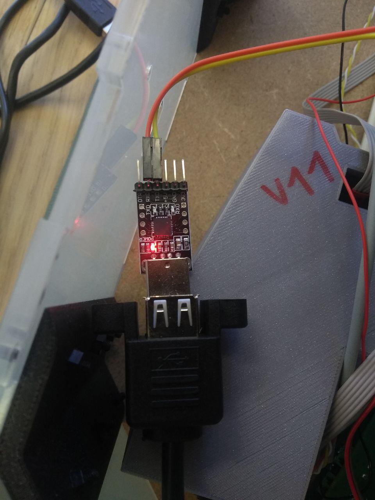

# Lidar on the VacRob

One of the main sensors that are placed on the robot is a lidar. This works by emitting a laser pulse and calculating the time it takes to get back (light sensor). The whole device spins, which allows to get distance measurements on a whole plane with a high resolution (1 pt/degree). The lidar that we use is the **Neato XV11 Lidar** (that is found on the neato vacuum robots).

## Some specifications

**Neato XV11 lidar:**

- 360 points per rotation
- controlled through UART (RX/TX)
- around 100 USD

## Position and fixation on the VacRob

The lidar is placed on the robot's top, about 15 cm away from it's center. It is fixed with spacers and 4 M3 screws. The laser is at a height of about 20 cm above the ground. This could be a problem to detect very low objects, but the distance modules should compensate this a little.

## Wiring


Neato lidar pinout

They are 6 cables to connect.

**Computer module:**

- **Motor:** GND and 4.2V
  - GND: H102, pin 28
  - 5V: H102, pin 30 -> to make 4.2V from 5V, we solder a N4148 diode on the jump cable that goes to the + pin of the motor -> 0.7V drop
- **Comms:** RX and TX (solder 0 Ohm resistors on JP111 and JP112)
  - RX: H10, pin 39
  - TX: H101, pin 40
- **Lidar power:** GND and 5V
- - GND: H102, pin 25
  - 5V: H102, pin 29

## Reading data from serial

First setup:

- we connect the robot computer to an external screen, keyboard and mouse
- we get internet through an Ethernet cable
- we power the raspberry through micro usb -> this also powers the lidar and the lidar motor

More advanced setup:

- Raspberry powered by micro USB
- Raspberry hosting VNC server
- computer connected to the VNC server to see and act on what's on the touch screen of the raspi

We use the `screen` command to see if there is any data on the serial bus. `screen` takes two arguments: port and baud rate!

```bash
screen /dev/ttyAMA0 115200
```

To see all the serial devices that are accessible, use this bash command:

```bash
dmesg | grep tty
```

**Remark:** This (`screen`) did not work with the first lidar we had -> black screen showing up, or screen terminating immediately. Indeed, we used the oscilloscope to verify the logic level of the data on the serial bus, and it was 5 volts: a lot too high for the 3.3V raspi -> the serial port is probably broken.

To overcome this problem, we use a serial USB dongle plugged in the raspberry pi. The RX and TX lines were just plugged in the corresponding header pins, as shown underneath.



This allowed us to `screen` the lidar, which is now on `ttyUSB0`.

```bash
screen /dev/ttyUSB0
```

This time, some weird characters showed up in the terminal, which shows that the communication was received (even though the baud rate was wrong).

## Plotting data in `rviz`

Procedure to follow: [https://wiki.ros.org/xv_11_laser_driver/Tutorials/Running%20the%20XV-11%20Node](https://wiki.ros.org/xv_11_laser_driver/Tutorials/Running%20the%20XV-11%20Node)

Install driver package:

```bash
udo apt-get install ros-kinetic-xv-11-laser-driver
```

Build driver from source:

```bash
cd catkin_ws/src
git clone https://github.com/rohbotics/xv_11_laser_driver.git
cd ..
catkin_make
source devel/setup.bash
```

Launch ROS:

```bash
roscore
```

To kill ROS (it can be useful after some new installs), just use:

```bash
killall roscore
```

Finally, launch the lidar driver (in background):

```bash
rosrun xv_11_laser_driver neato_laser_publisher _port:=/dev/ttyUSB0 &
```

You should also create a reference frame for the lidar data to be shown:

```bash
rosrun tf static_transform_publisher 0 0 0 0 0 0 1 map my_fra 10 &
```

To see what the inputs that ROS detects are (very useful for debug):

```bash
rostopic list
```

In all the parameters listed, `/rpms` is the number of rotations per minute that the lidar does (it should be around 360!) and `/scan` is the data generated by the lidar.

```bash
rostopic echo /screen
```

Launch `rviz`:

```bash
rosrun rviz rviz
```

## To do every time `rviz` is run

Create frame called `neato_laser`:

```bash
rosrun tf static_transform_publisher 0 0 0 0 0 0 1 map neato_laser 10 &
```

Run lidar driver:

```bash
rosrun xv_11_laser_driver neato_laser_publisher _port:=/dev/ttyUSB0 &
```

Launch `rviz`:

```bash
rosrun rviz rviz
```

## Launch rviz config automatically at boot

### Launch rviz once logged in

[https://askubuntu.com/questions/542953/command-not-running-in-rc-local-but-works-in-terminal](https://askubuntu.com/questions/542953/command-not-running-in-rc-local-but-works-in-terminal)

Modify the file `/etc/rc.local` and add to the end:

```bash
rosrun tf static_transform_publisher 0 0 0 0 0 0 1 map neato_laser 10 &
rosrun xv_11_laser_driver neato_laser_publisher _port:=/dev/ttyUSB0 &
rosrun rviz rviz -d /home/ubuntu/.rviz/lidarFullScreen.rviz
```

## Links

- tutorial on how to test/use the lidar: [https://www.impulseadventure.com/elec/robot-lidar-neato-xv11.html](https://www.impulseadventure.com/elec/robot-lidar-neato-xv11.html)
- manage to visualize the data in ROS: [https://wiki.ros.org/xv_11_laser_driver/Tutorials/Running%20the%20XV-11%20Node](https://wiki.ros.org/xv_11_laser_driver/Tutorials/Running%20the%20XV-11%20Node)
- documentation about rviz: [https://github.com/cse481sp17/cse481c/wiki/Lab-11:-Visualizations-in-ROS-with-RViz](https://github.com/cse481sp17/cse481c/wiki/Lab-11:-Visualizations-in-ROS-with-RViz)
