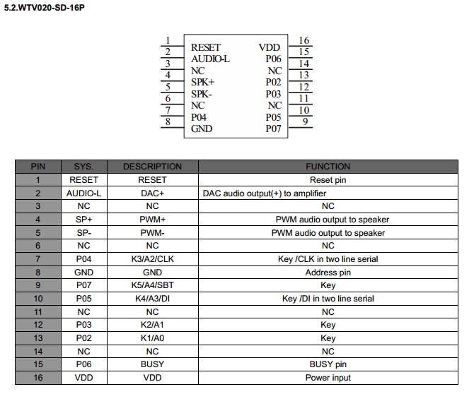
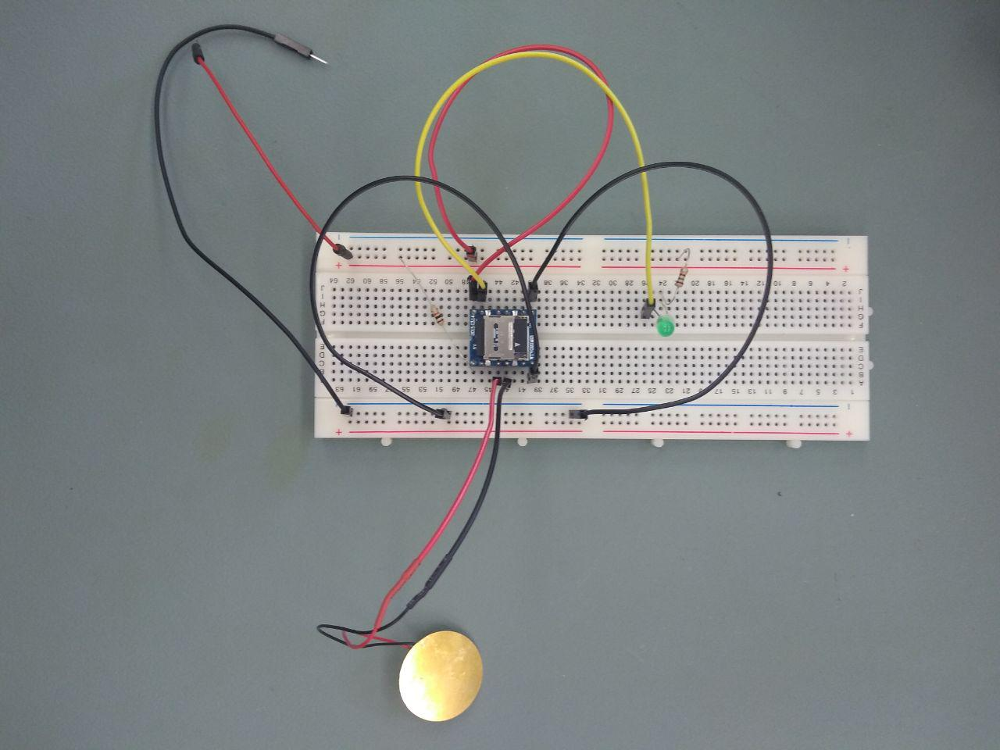

# Piezo speaker and WTV020M01 module to play audio files

We want to integrate a speaker to make the VacRob scream and swear when it bumps into walls.

To achieve thi, we are using a WTV020M01 module and a super cheap piezo speaker.

## Specifications

- you have to solder a jumper to select 3.3V power supply
- uses a micro SD card (recommended <= 2B)
- the audio format is a proprietary format (AD4): to overcome this, convert the files into 16 bits ...
- the file to be played is set through an SPI interface

Pinout of the audio module.

## Wiring for testing

- **Pin 4:** speaker VCC
- **Pin 5:** speaker GND
- **Pin 8:** GND
- **Pin 15:** BUSY -> we put an LED on it and a pull-up resistor -> the LED will be on when no file is played
- **Pin 16:** 3.3V (not more!)

Final setup:

## Tests and conclusion

The more we looked for information about the mp3 module, the less convinced we got about using it. Indeed, not only does it not actually use mp3 files, but the format in accepts is proprietary. In addition, after setting up the circuit using a breadboard, it didn't seem to work at all, and the debbugging looked very difficult. Indeed, the connections on the breadboard were very insecure.

In the end, we decided to abandon this approach.

Another possibility, however, might be to use an Alexa Echo dot and make Alexa say things when the robots bumps into a wall. This might however be too complex to do in the time we have.

Finally, a bluetooth speaker could simply be connected to the rapsberry pi, which would play mp3 files when an interrupt is detected.

## Links

- datasheet: [https://www.elechouse.com/elechouse/images/product/MP3%20Sound%20Mini%20SD%20Card%20Module/MP3%20Mini%20SD%20Card%20Module.pdf](https://www.elechouse.com/elechouse/images/product/MP3%20Sound%20Mini%20SD%20Card%20Module/MP3%20Mini%20SD%20Card%20Module.pdf)
- test without micro-controller: [https://nerdclub-uk.blogspot.com/2016/06/playing-audio-with-wtv020m01-and-arduino.html](https://nerdclub-uk.blogspot.com/2016/06/playing-audio-with-wtv020m01-and-arduino.html)
- convert mp3 to compatible format: [https://www.iot-experiments.com/wtv020m01-mp3-to-compatible-wav/](https://www.iot-experiments.com/wtv020m01-mp3-to-compatible-wav/)
- arduino tutorial: [https://www.electronoobs.com/eng_arduino_tut8.php](https://www.electronoobs.com/eng_arduino_tut8.php)
