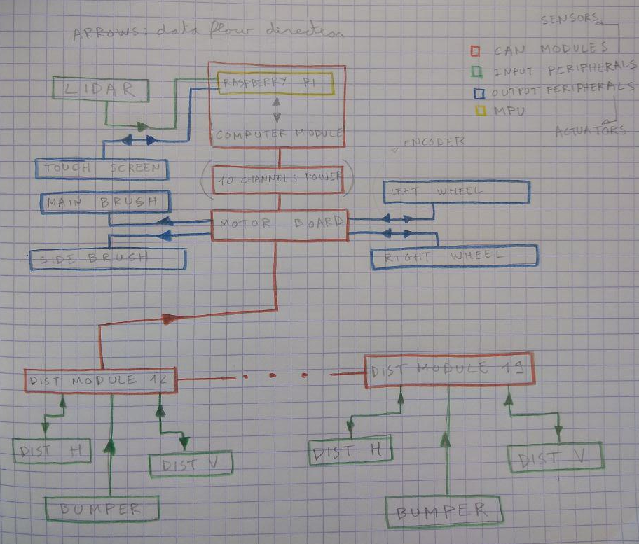

# VacRob software

In the end, the VacRob is a fairly complex system with over ten micro-controller. Therefore, we have to have a very clear idea how all the different components interact with each other. Also, we must know what is dependent from what, what is critical in time, etc.

## Overview of the robot's elements

The VacRob contains all of the following elements:
- 1 compute module (integrate a Raspberry Pi)
- 1 DC motor module rev2
- (1 10 channels power output module)
- 8 mini distance modules rev 2
- 1 Neato X11 lidar
- 1 raspi 7'' touch screen
- 2 Xiomi Roborock active wheels
- 1 Xiomi Roborock main brush
- 2 Xiomi Roborock side brush
- (1 Xiomi Roborock pump)

## General description of the behavior

Listed underneath are all the functionalities that would be useful to implement in the robot. We haven't been able to achieve all off them,

1) The robot could move on a flat surface using a differential drive. It should be able to move forwards and backwards, and turn while going in these two directions.

2) The robot should have an autonomous mode where it is able to follow a corridor and remain in the middle of it (control loop). To achieve this, the only input it has is the distance measurement of the eight distance boards placed on its faces.

3) The robot's lidar must be operational. It must be connected to the raspberry by, which runs ROS. The lidar scan must be plotted in real time in the integrate touch screen.

4) The robot must be able to detect stairs and other dangers of fall. Whenever such a situation is detected, the robot must either immediately stop, or move in the direction opposite to the hazard.

5) The robot must have a mode in which it stops whenever an obstacle is detected at a distance smaller of equal to 10 cm. 

6) The robot must have a mode in which it shouts and swears whenever it bumps into an obstacle.

7) A user interface using the screen should be programmed, which would allow to chose between different modes. 

8) The user should be able to remote control the robot from a computer.

9)  The user should be able to visualize all the data produced by the robot in real time.

