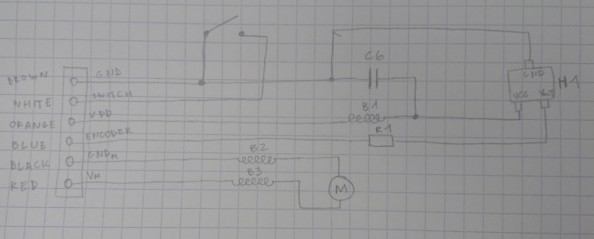

# The PCBs of the robot

[Home](../../../README.md) | [Project main page](../../xiaomiRemake.md)

## Computer board (big format)
The computer board is the main board of the project. A Raspberry PI slides onto it and acts as the main micro-controller. The Lidar, the screen and the battery will be directly connected to it.

## DC motor board (big format)

Project cloned with: `git clone ssh://git@make.octanis.ch:2222/oi/oibus-dc-motor-controller.git`

GitLab project: [https://make.octanis.ch/oi/oibus-dc-motor-controller/tree/master](https://make.octanis.ch/oi/oibus-dc-motor-controller/tree/master)

The motor board has to be enhanced to become functional. The goal is to solve all the issues of the project. The board allows to control __4 DC motors__. It uses __H-bridges__ to chose the rotation direction.

In the whole robot, they are 5 motors of 4 different types. The wheels motors are __brushed DC motors__ with a __hall effect encoders__. The brushes motor are brushed DC as well, but do not have encoders. All these motors speed varied using a __PWM signal__ from the micro-controller. Hypothetically, varying the input voltage could also achieve that. However, DAC should be used, which do not allow high currents. It is therefore not a good approach.

We assume that the maximal voltage the motors should be powered by is __12V__ (checked).

__H-bridge component:__ [__VNH7040AYTR__, Motion Motor Control](https://www.arrow.com/en/products/vnh7040aytr/stmicroelectronics?utm_campaign=octopart_2018&utm_currency=USD&utm_keyword=VNH7040AYTR&utm_medium=aggregator&utm_content=inv_listing&utm_source=octopart)

__Wheels Hall effect sensor:__ [__TCS40DPR__](../datasheets/TCS40DPR_hall_sensor.pdf)

One of the problems to solve is that the board does not manage __encoders__ of the DC motors. We made reverse engineering to understand which pins of the wheels connector corresponded to the encoder.

### VNH7040AYTR (H-bridge)

### TCS40DPR (Hall sensor, encoder of the wheels)

Datasheet: [__TCS40DPR__](../datasheets/hallSensor/TCS40DPR_hall_sensor.pdf)

- Digital Output Magnetic Sensor
- 3 terminal device: GND, VCC (2.3 to 5.5V), OUT (0 to  VCC V)
- [https://sensing.honeywell.com/hallbook.pdf](https://sensing.honeywell.com/hallbook.pdf) p. 25: "The output of a digital Hall effect sensor is NPN (current sinking, open collector)."
- p. 26 : "The current sink configuration produces a logic “0” condition when a magnetic field of sufficient magnitude is applied to the sensor."
- use a pull-up resistor!

After running tests using the oscilloscope, we observed that a 2.2k$\Omega$ pull-up resistor works fine. The chip works when alimented in 3.5V. The signal drops  to GND when a magnetic field over a certain value is measured. The fastest the motor spins, the highest the frequency is.

Wheels reverse engineered electric scheme:

### MPN of a few components

Blue led orthogonal : IN-S63AS5B
Red led orthogonal : IN-S63AS5R
2.2k resistor : RC0603JR-072K2L
10K resistor : RC0603JR-0710KL
molex microblade connector 4 pins : 53261-0471

## Distance and bump sensing board (small format)

Each board should include two distance sensors, one vertical (to prevent fall) and one horizontal, and one bump sensor. The sensor we want to use is an SMD, therefore, a daughter board has to be designed to have one sensor perpendicular to the other. Another possibility, as Sam says, would be to make a __rigid-flex PCB__.

Distance sensor: [__VL53L0X, Time-of-Flight (ToF) ranging sensor__](https://www.st.com/en/mems-and-sensors/proximity-sensors.html#products)

Snap switch (endstop): [https://www.digikey.com/product-detail/en/zf-electronics/DB3CB1LB/CH880-ND/1083873](https://www.digikey.com/product-detail/en/zf-electronics/DB3CB1LB/CH880-ND/1083873)

Board to board connector: [https://www.digikey.com/en/product-highlight/a/amphenol-fci/minitek-connectors](https://www.digikey.com/en/product-highlight/a/amphenol-fci/minitek-connectors)

AVX board-to-board connector spec for male layout:

###  VL53L0X (distance sensor)

- ToF (time-of-flight) module
- __940 nm__ VCSEL emitter

### MPN of a few components

AVX 6 pos BTB connector: 009159006551906
Limit switch: DB3CB1LB

## Coral board (small format)

To design!

Coral is an IA that detects objects and recognizes them. A board integrating it will be needed. THe coral hardware is a USB stick
