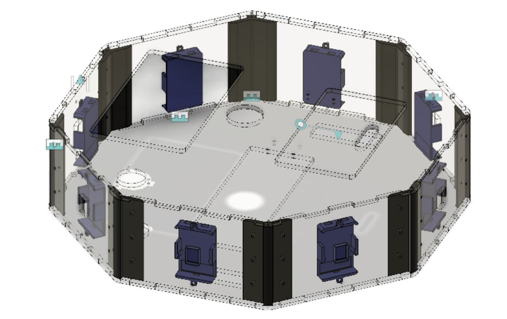

# XIAOMI MI ROBOROCK Remake

## Goal
Make a vacuum cleaning robot applying the technologies developped at Octanis Instruments. The robot will use some of the same components as the Xiaomi Mi Roborock robot. Yet, all the user interface, the electronics and the sensors will be new.

## Mechanics

First of all, the focus has been put on the mechanical aspect of the project: in other words, the case. This had to be made using the techniques at disposition, namely __laser cutting__ and __3D printing__ (CNC milling could also be considered). Laser cutting has the advantage to be fast, however, the shapes that can be realized are limited. On the contrary, 3D printing is slow, but allows a large variety of shapes (especially with resin printing -> to try out!).

To realize the models (either 2D or 3D), __Fusion 360__ has been used, which is an open-source CAD software.

__General concept of the case:__ The case is has an __octogonal base__ with a width of about 400 mm and a height of about 100 mm. The sides, top and bottom are laser-cut out of transparent acrylic glass. The case holds together thanks to screws and dented sides that slot one into the other. The inner components are all maintained in place by specific 3D printed parts.

_Outer case assembled in Fusion 360_

## Various parts description / comment

### The hinges
Hinges are needed to make a door that allows easy access to the dust collector and to the battery. Initially, regular commercial brass hinges were to be used. However, they were finally 3D printed using flexible filament. This allows to vary the shape, size and color of the hinges (not sure that it is cheaper, though).

A first try was made in PLA, but it did not work, for the part broke instead of bending. Afterwards, FlexiSMART filament was used, which worked perfectly (-> see [video](../xiaomiRemake/docs/pictures/flexHinge.mp4)).

## Electronics

### VNH7040AYTR notes

