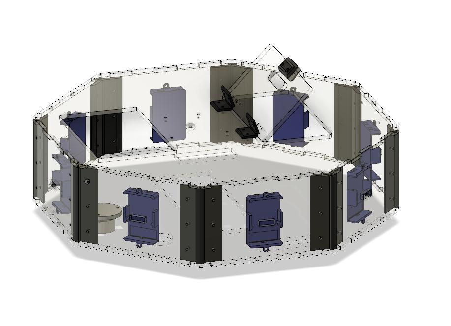
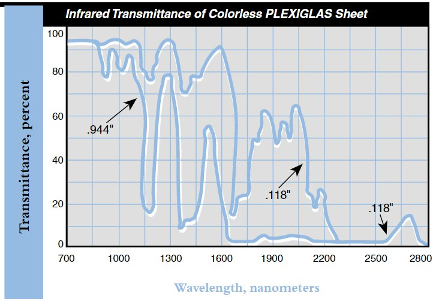

# Vacuum cleaner robot

[Home](../README.md) | [Links / References](./docs/refs.md) | [Project PCBs doc](./docs/pcd/pcb.md)

## Goal

Make a vacuum cleaning robot applying the technologies developed at Octanis Instruments. The robot will use some of the same components as the Xiaomi Mi Roborock (already existing vacuum cleaner robot). Yet, all the user interface, the electronics and the sensors will be new.

## Mechanics

First of all, the focus has been put on the mechanical aspect of the project: in other words, the case. This had to be made using the techniques at disposition, namely **laser cutting** and **3D printing** (CNC milling could also be considered). Laser cutting has the advantage to be fast, however, the shapes that can be realized are limited. On the contrary, 3D printing is slow, but allows a large variety of shapes (especially with resin printing -> to try out!).

To realize the models (either 2D or 3D), **Fusion 360** has been used, which is an open-source CAD software.

**General concept of the case:** The case is has an **octogonal base** with a width of about 400 mm and a height of about 100 mm. The sides, top and bottom are laser-cut out of transparent acrylic glass. The case holds together thanks to screws and dented sides that slot one into the other. The inner components are all maintained in place by specific 3D printed parts.

_Outer case assembled in Fusion 360_

### List of parts necessary to build the case

- 1 5mm acrylic glass top part
- 1 5mm acrylic glass flap part
- 1 5mm acrylic glass bottom part
- 8 5mm acrylic glass side parts
- 8 3D printed corner parts
- 2 3D printed flexible hinges
- 1 3D printed clip (to keep the flap in place)
- 1 3D printed flexible bottom clip (to keep the flap in place)
- 74 M3x15 black nylon screws
- 58 M3 black nylon bolts

### Not making holes for distance sensors

The distance sensor that we want to use (VL53L0X) emits at 940 nm. Referring to the image underneath, clear plexiglass has a high transmittance at this frequency. Therefore, it could be possible to use the distance sensor through the plexiglass (no holes required).

[Plexiglas optical and transmission characteristics](https://www.plexiglas.com/export/sites/plexiglas/.content/medias/downloads/sheet-docs/plexiglas-optical-and-transmission-characteristics.pdf)

### The hinges

Hinges are needed to make a door that allows easy access to the dust collector and to the battery. Initially, regular commercial brass hinges were to be used. However, they were finally 3D printed using flexible filament. This allows to vary the shape, size and color of the hinges (not sure that it is cheaper, though).

A first try was made in PLA, but it did not work, for the part broke instead of bending. Afterwards, FlexiSMART filament was used, which worked perfectly (-> see [video](../xiaomiRemake/docs/pictures/flexHinge.mp4)).

### Laser cutting the outer case

The laser cutter used is the [FabKit MI5](https://www.fabcreator.com/Fabkit) with the [LightBurn](https://lightburnsoftware.com/pages/trial-version-try-before-you-buy) software.

The laser cutter maximal cut dimensions are 680x470yx125mm.

#### Faces

The parts are cut in 5mm thick clear PMMA. The cut parameters used were:

- speed: 6mm/s
- max power: 100%
- min power: not defined

#### Top and bottom

Because the PMMA sheets available were too small to cut the top and bottom, some new material had to be bought. However, due to bad advice, polystyrene (PS) was bought instead of PMMA. Yet, PS can also be laser-cut. One of it's disadvantages, though, is that it is breakable (it cracks easily). To be able to laser-cut the parts, the initial sheet (1000x500x5mm) had to be cut in two using a jigsaw. This was not a god idea for two reasons: the PS was scratched ba the machine and it cracked a bit in some places.

After some testing, the best method to cut this material seemed to be by covering it with masking tape. So, the two PS parts were covered with tape, and then taped to the bed of the laser cutter, to keep them as flat as possible. A problem occured both times while cutting the parts: the cutter suddenly stopped in the middle of the cut. To fix that, I clicked "Stop" and then "Start" again, but I only turned the laser on when I reached the point where the cut had previously stopped (be careful not to lose the origin by clicking "Home").

Another problem with PS is that the cut is not as clean as with PMMA, and some of the melted plastic goes under the parts. It was removed using a spatula.

The parts are cut in 5mm thick clear PS. The cut parameters used were:

- speed: 4mm/s
- max power: 100%
- min power: not defined

#### Parts dimensions

- **face:** 165.685 x 110 mm
- **top:** 427.526 x 427.526 mm
- **bottom:** 427.526 x 427.526 mm

## Electronics

It is important to design the outer case in a way that put forward the electronics inside, indeed, the goal of the robot is to show the ecosystem developed ba the company, which mainly consists of the easy to assemble PCBs and the software.

The robot required some functionalities that had already been developed, like the computer board. However, some boards had either to be modified (DC motor module) or completely designed (distance sensing module).

For more precise information about the electronics, click [here](./docs/pcb/pcb.md).

### Power supply

Three packs in serie of four 18x680 batteries in parallel are used as a power supply. This results in a voltage of 11.1V and a power of

## Things to consider

- we could place a robotic arm on the robot if it supported the weight ([AR2](https://www.youtube.com/watch?v=CCgI4R1TEzI))
- adaptive gripper? [https://www.thingiverse.com/thing:2527079](https://www.thingiverse.com/thing:2527079) and [https://www.youtube.com/watch?v=x9KWuQXTURI](https://www.youtube.com/watch?v=x9KWuQXTURI)
- add LEDs or a microphone for user interface

## Software / Firmware

### UAVCAN
the message type to use for the distance sensor output: [https://github.com/UAVCAN/public_regulated_data_types/blob/master/uavcan/equipment/range_sensor/1050.Measurement.uavcan](https://github.com/UAVCAN/public_regulated_data_types/blob/master/uavcan/equipment/range_sensor/1050.Measurement.uavcan)